# 智课 AI 个性化学习工作台

## 1. 项目定位

本项目是面向学习场景的 **AI 个性化学习工作台系统**。

它不是传统课程内容展示平台，也不是单纯 AI 聊天工具，更不是只围绕文档问答构建的知识库问答系统，而是围绕 **通用学习对话、课程上下文、Chat / Agent 能力、云端 RAG 课程资料问答、学习路径、学情画像、资源生成、资源沉淀和管理端治理** 形成的智能学习闭环。

系统需要同时支持三类使用场景：

1. **指定课程学习场景**：用户选择某门课程后，系统围绕课程知识库、学习路径、课程画像和课程资源进行问答、生成与推荐。
2. **未指定课程的通用学习场景**：用户不选择课程，也可以像通用 AI 学习助手一样直接提问、规划学习、生成资料和沉淀通用画像。
3. **临时资料 / 临时任务场景**：用户围绕一次对话、一个主题或上传材料进行短期学习，不强制绑定到固定课程。

整体产品形态可以概括为：

> 以 AI 对话为主入口，以课程资料问答作为显式知识库模式，以多层学习画像为个性化依据，以学习路径为课程内学习任务组织方式，以资源大厅为资源沉淀空间，以知识大本营、网关中心、资源审核和运维监控作为管理端支撑。

---

## 2. 详细设计文档

项目详细规范已拆分到 `docs/` 目录，README 只保留总纲和索引。

| 文档 | 内容 |
|---|---|
| [docs/01-product-overview.md](./docs/01-product-overview.md) | 项目定位、核心价值、整体闭环、需求对应关系、视觉风格。 |
| [docs/02-route-and-page-design.md](./docs/02-route-and-page-design.md) | 用户侧路由、管理端路由、页面功能、WorkspaceLayout 页面模式。 |
| [docs/03-learning-profile-design.md](./docs/03-learning-profile-design.md) | 多层动态学习画像、全局画像、课程画像、会话画像、无课程场景、多课程切换、画像更新规则。 |
| [docs/04-ai-orchestration-design.md](./docs/04-ai-orchestration-design.md) | Chat / Agent 与 Cloud RAG 解耦、AiOrchestrator、HybridIntentRouter、Provider Adapter 边界。 |
| [docs/05-resource-generation-design.md](./docs/05-resource-generation-design.md) | 多智能体资源生成、ResourceTaskCard、ArtifactCanvas、资源生命周期。 |
| [docs/06-admin-design.md](./docs/06-admin-design.md) | 知识大本营、网关中心、资源审核、运维监控、课程建设台、公告发布、界面设置、ChatDoc 配置。 |
| [docs/07-api-data-and-acceptance.md](./docs/07-api-data-and-acceptance.md) | API 设计、核心数据模型、验收标准、调用边界速查。 |
| [docs/08-knowledge-mindmap-skill-design.md](./docs/08-knowledge-mindmap-skill-design.md) | 知识思维导图 Skill 的触发条件、输入输出契约、多智能体流程和质量核验。 |
| [docs/09-current-function-inventory-and-extension-plan.md](./docs/09-current-function-inventory-and-extension-plan.md) | 当前功能盘点、总体统计、已有基本能力清单和可拓展内容建议。 |
| [docs/11-feature-screenshots.md](./docs/11-feature-screenshots.md) | 功能界面效果展示，按产品模块汇总核心界面截图。 |
| [docs/15-computer-ai-curriculum.md](./docs/15-computer-ai-curriculum.md) | 计算机与人工智能课程体系规划、GitHub 学习资料目录与智课承载映射。 |
| [docs/16-knowledge-base-completion-plan.md](./docs/16-knowledge-base-completion-plan.md) | 本地知识库补全实施记录、语料导入、知识点映射与验证结果。 |
| [docs/17-github-upload-and-reproduction.md](./docs/17-github-upload-and-reproduction.md) | GitHub 上传范围、不上传清单、其他开发者复刻与验证指南。 |

---

## 效果预览

核心功能界面一览，完整大图见 [docs/11-feature-screenshots.md](./docs/11-feature-screenshots.md)。

| 模块 | 界面 |
|---|---|
| 学习入口 | [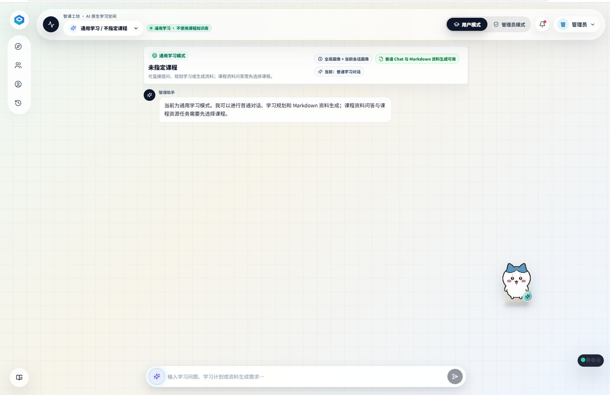](docs/11-feature-screenshots.md) |
| 课程上下文 | [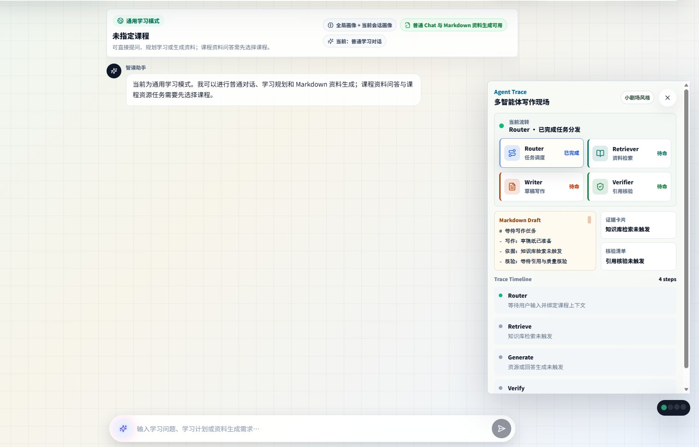](docs/11-feature-screenshots.md) |
| 快捷生成 | [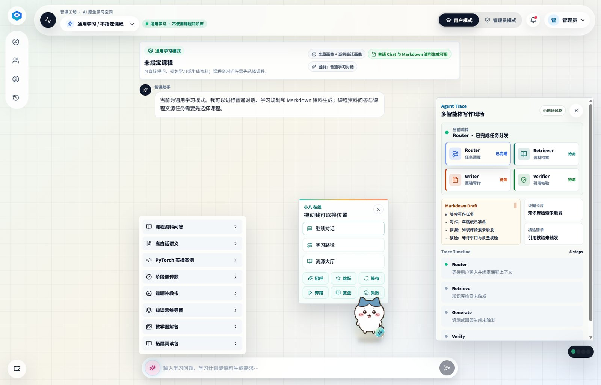](docs/11-feature-screenshots.md) |
| 伴随式交互 | [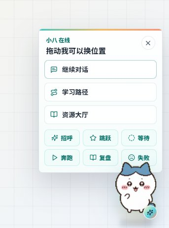](docs/11-feature-screenshots.md) |
| 内容生成 | [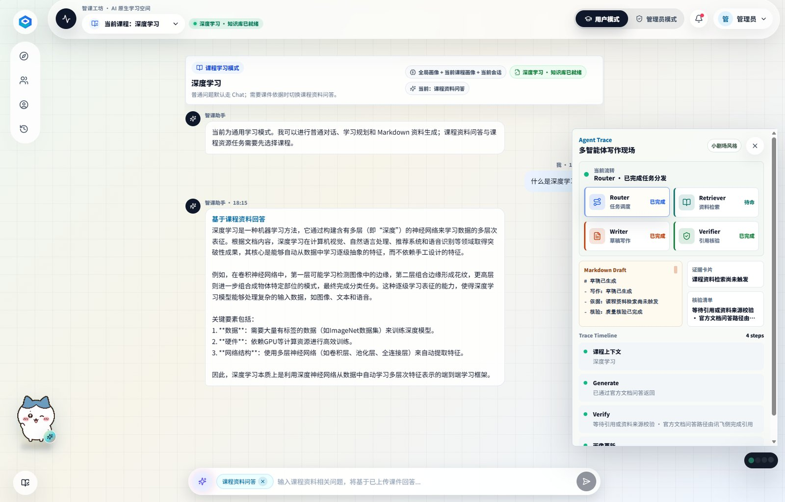](docs/11-feature-screenshots.md) |
| 资源工坊 | [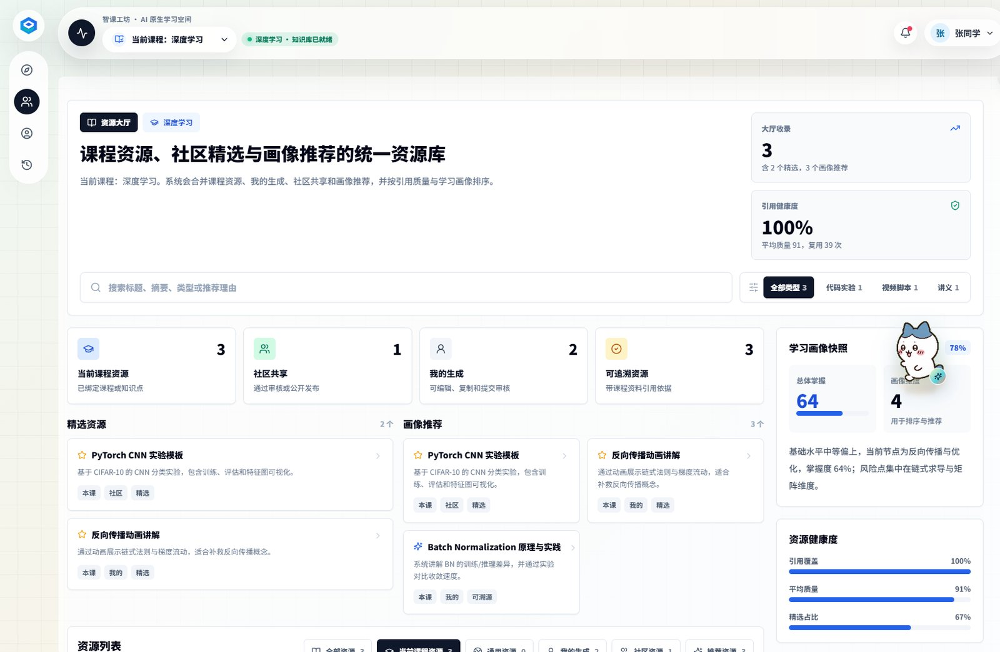](docs/11-feature-screenshots.md) |
| 资源沉淀 | [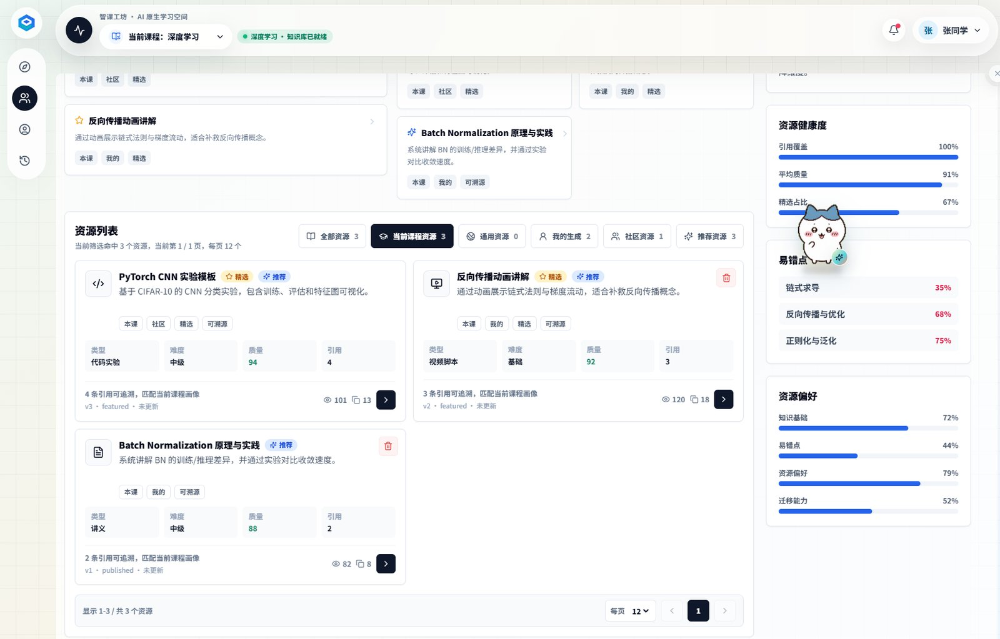](docs/11-feature-screenshots.md) |
| 学习路径 | [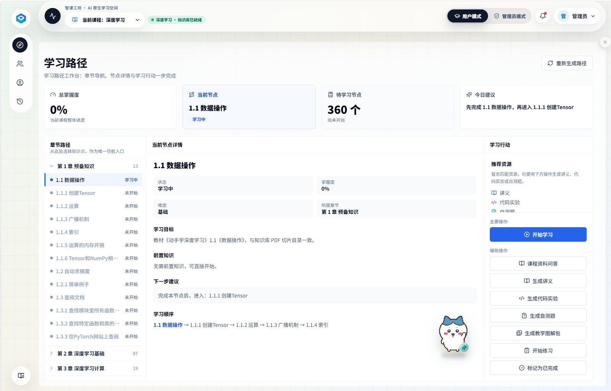](docs/11-feature-screenshots.md) |
| 学情画像 | [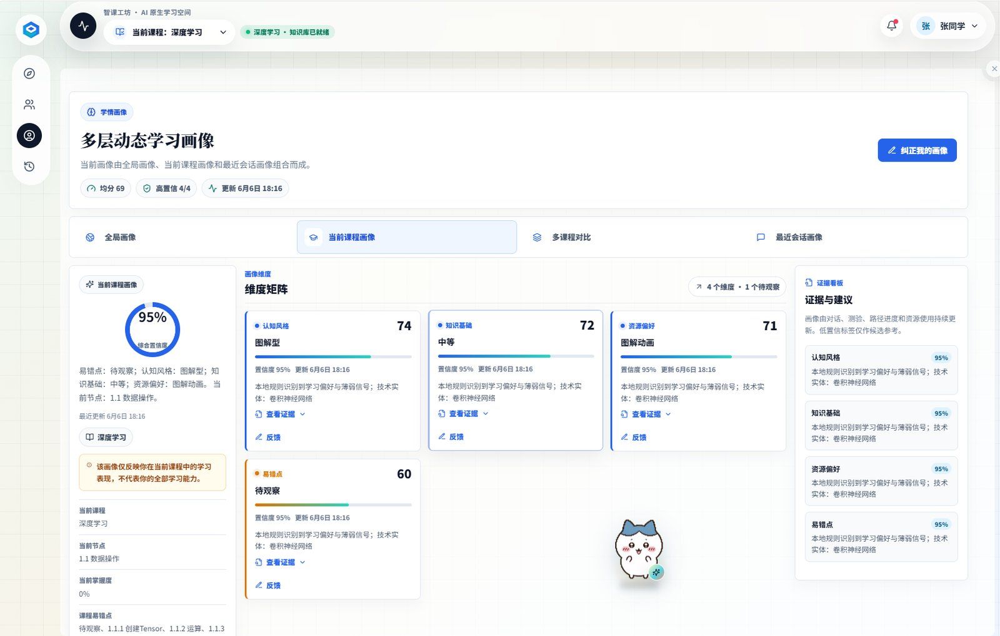](docs/11-feature-screenshots.md) |
| 个人治理 | [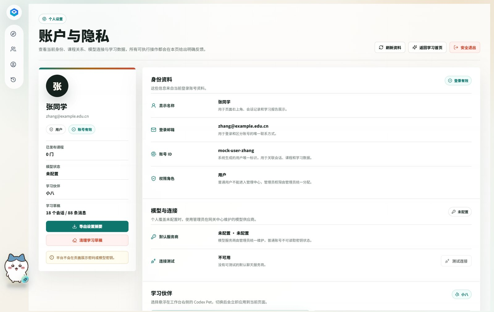](docs/11-feature-screenshots.md) |
| 伙伴配置 | [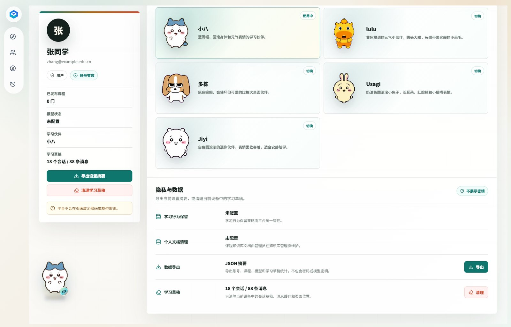](docs/11-feature-screenshots.md) |
| 知识治理 | [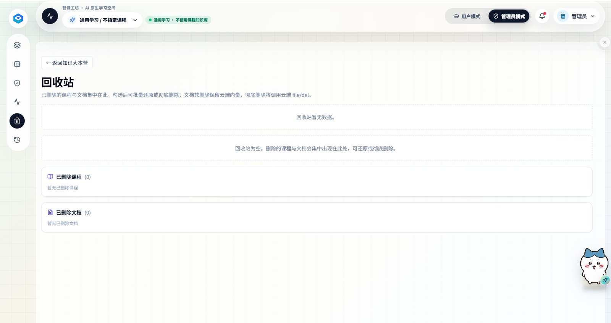](docs/11-feature-screenshots.md) |
| 资源审核 | [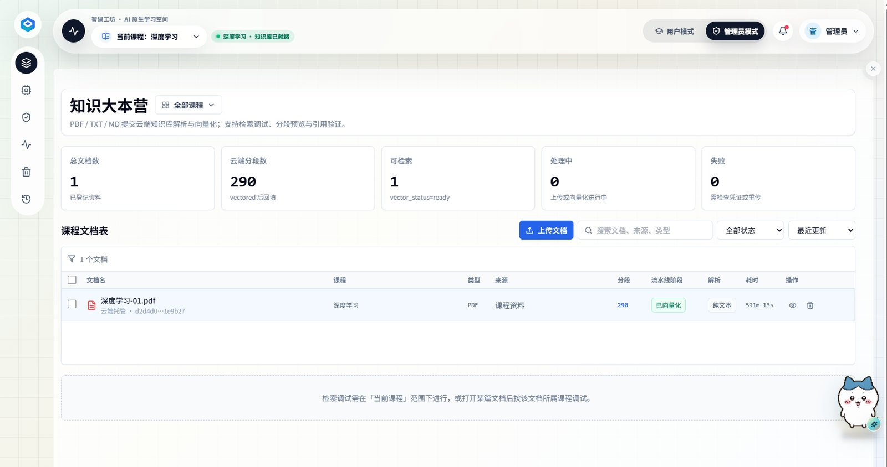](docs/11-feature-screenshots.md) |
| 模型网关 | [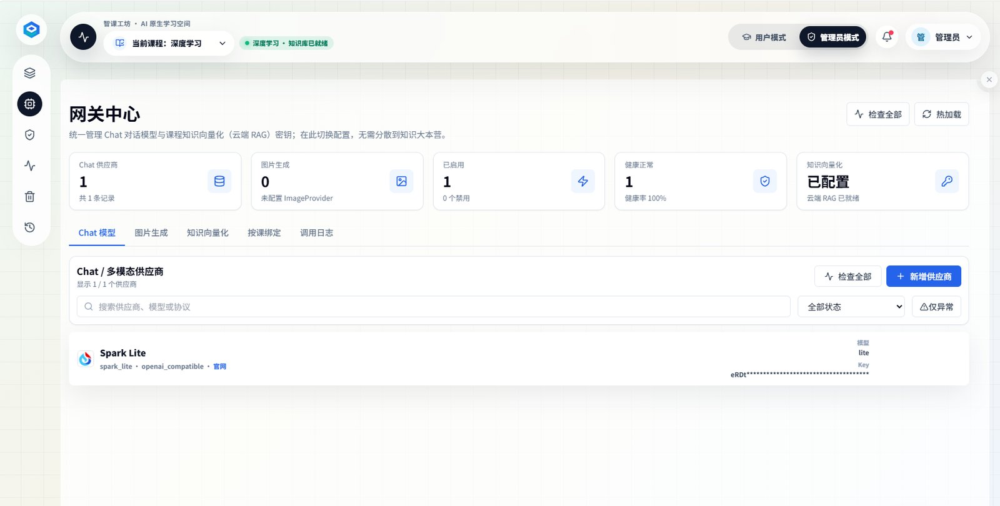](docs/11-feature-screenshots.md) |
| 调用观测 | [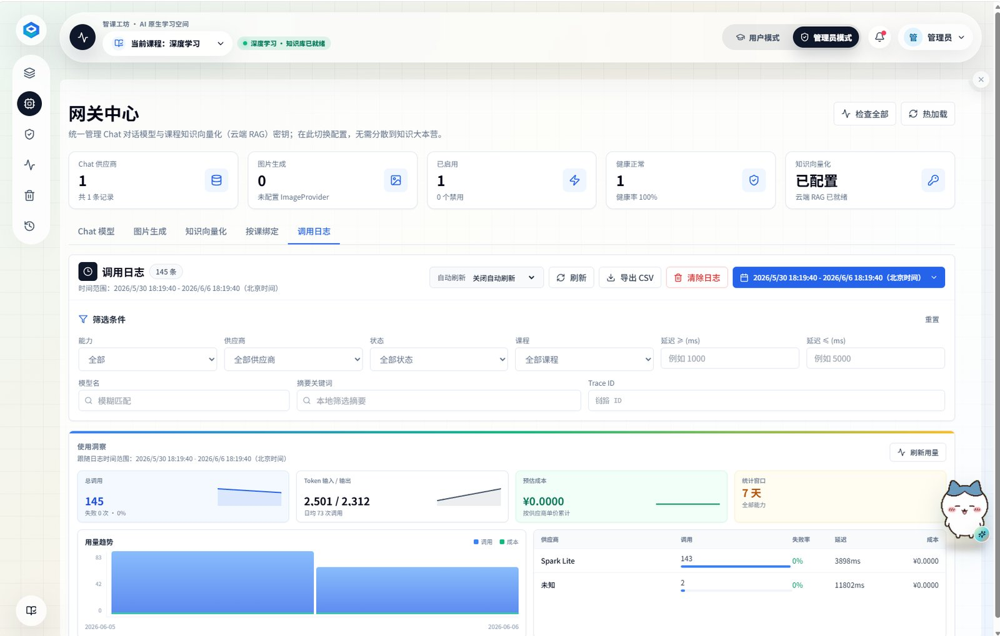](docs/11-feature-screenshots.md) |
| 运维监控 | [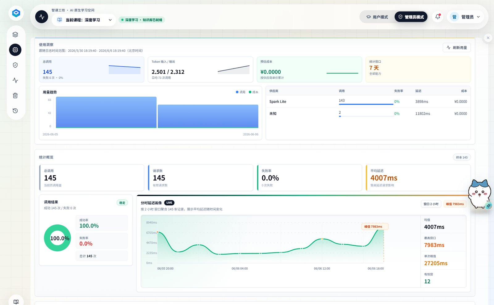](docs/11-feature-screenshots.md) |

---

## 技术栈

### 前端

| 技术 | 用途 | 版本 |
|---|---|---|
| **React** | UI 框架 | ^18.3.1 |
| **TypeScript** | 类型系统 | ^5.7.2 |
| **Vite** | 构建工具 | ^6.0.6 |
| **Tailwind CSS** | CSS 框架 | ^3.4.17 |
| **React Router** | 路由管理 | ^7.1.1 |
| **Zustand** | 客户端状态管理 | ^5.0.2 |
| **TanStack Query** | 服务端数据获取与缓存 | ^5.62.8 |
| **React Markdown + remark-gfm + KaTeX** | Markdown 渲染与数学公式 | ^9.0.1 / ^4.0.1 / ^0.16.47 |
| **Framer Motion** | 动画 | ^12.40.0 |
| **XYFlow** | 思维导图与流程图 | ^12.10.2 |
| **ECharts** | 图表 | ^5.5.1 |
| **Lucide React** | 图标库 | ^0.468.0 |
| **PDF.js** | PDF 文档预览 | ^4.10.38 |
| **docx** | DOCX 导出 | ^9.7.1 |
| **PptxGenJS** | PPTX 导出 | ^4.0.1 |
| **Playwright** | E2E 测试 | ^1.60.0 |
| **Vitest** | 单元测试 | ^3.0.5 |

### 后端

| 技术 | 用途 | 版本 |
|---|---|---|
| **Python** | 编程语言 | 3.12.x |
| **FastAPI** | Web 框架 | 0.115.6 |
| **Uvicorn** | ASGI 服务器 | 0.34.0 |
| **Pydantic v2** | 数据校验与配置管理 | ≥2.10.4 |
| **SQLAlchemy 2.0** | ORM | ≥2.0.36 |
| **PostgreSQL (psycopg)** | 关系型数据库驱动 | ≥3.2.3 |
| **Alembic** | 数据库迁移 | 1.14.0 |
| **Redis** | 缓存与会话状态 | 5.2.1 |
| **WebSockets** | 实时通信 | 14.1 |
| **LangChain** | AI 应用框架 | 0.3.13 |
| **LangGraph** | 多智能体工作流编排 | 0.2.60 |
| **semantic-router** | 意图路由 | ≥0.1.15 |
| **OpenAI SDK** | 大语言模型调用 | ≥1.0.0 |
| **Cohere** | Embedding / RAG | ≥5.0.0 |
| **Argon2 (argon2-cffi)** | 密码哈希 | ≥23.1.0 |
| **PyMuPDF** | PDF 处理 | 1.25.1 |
| **tiktoken** | Token 计数 | ≥0.8.0 |
| **pytest** | 测试框架 | 8.3.4 |
| **ruff** | 代码检查与格式化 | 0.15.16 |
| **httpx** | HTTP 客户端 | 0.28.1 |
| **orjson** | 高性能 JSON 序列化 | ≥3.10.12 |
| **cryptography** | 加密工具 | 43.0.3 |

### 整体架构

```text
前端 (React 18 + TypeScript + Vite + Tailwind CSS)
        ↓ HTTP / WebSocket（端口 5173 → 代理到 8001）
后端 (FastAPI + Python 3.12)
        ↓
数据层: PostgreSQL + Redis
AI 层: OpenAI / Cohere / semantic-router / LangChain / LangGraph
文档: PyMuPDF / PDF.js / docx / pptxgenjs
```

---

## 启动指南

以下提供 **本地开发启动** 和 **Docker Compose 一键启动** 两种方式，首次启动请先参考「环境准备」。

### 环境准备（首次）

```bash
# 1. 确认 Docker 已安装
docker --version
docker compose version

# 2. 配置环境变量（已配置过则跳过）
cp .env.example .env
# 编辑 .env：配置 JWT_SECRET_KEY（≥32字符）、数据库密码、模型 API Key 等

# 3. 创建后端虚拟环境（仅需一次）
cd backend
py -3.12 -m venv .venv
```

### 前端依赖说明

- 前端依赖以 `frontend/pnpm-lock.yaml` 为准，默认使用 `pnpm` 安装与恢复依赖。
- `frontend/package-lock.json` 仅保留为兼容性参考，不作为日常开发的首选锁文件。
- 如果混用 `npm install`、`pnpm install` 或在安装中断后继续复用旧的 `frontend/node_modules`，可能出现 `.bin` 可执行文件缺失、Vite 传递依赖缺失或目录结构不完整的问题。
- 当出现 `vite` 找不到、`Cannot find package 'fdir'` 或 `frontend/node_modules` 结构异常时，优先在 `frontend/` 目录执行以下恢复流程：

```bash
corepack enable
corepack prepare pnpm@11.9.0 --activate
corepack pnpm install --frozen-lockfile
```

- 项目通过 `frontend/package.json` 的 `packageManager` 固定 pnpm 版本；`frontend/pnpm-workspace.yaml` 中 `pmOnFail: ignore` 表示版本由 Corepack 管理，避免与全局旧版 pnpm 冲突。
- 若仍报版本不一致，请先执行上面的 `corepack prepare`，或卸载全局 pnpm（`npm uninstall -g pnpm`）后仅使用 `corepack pnpm`。

- 如需彻底重装前端依赖，先删除 `frontend/node_modules`，再重新执行上面的 `pnpm` 安装命令。

### 方式一：本地开发启动（推荐日常开发）

数据库和 Redis 通过 Docker 启动，前后端在本地运行。

**步骤 1：启动基础设施**

```bash
# 在项目根目录
docker compose up -d postgres valkey
```

**步骤 2：初始化数据库（首次或 migration 有更新时）**

```bash
cd backend
source .venv/Scripts/activate      # Windows
# source .venv/bin/activate        # Mac/Linux
alembic upgrade head
```

**步骤 3：启动后端**

```bash
cd backend
# 同一终端沿用上一步已激活的虚拟环境，无需重复 source
python run_dev.py
```

后端运行在 `http://localhost:8001`，支持热重载。

**步骤 4：启动前端（新开终端）**

```bash
cd frontend
corepack pnpm dev
```

前端运行在 `http://localhost:5173`，API 请求通过 Vite 代理到 `localhost:8001`。

**步骤 5：启动代码沙箱微服务（在线编程实验需要）**

```bash
cd backend/sandbox-service
npm install         # 首次安装 Pyodide + Express，Pyodide 体积较大，耗时较长
npm start           # 默认监听 http://127.0.0.1:8003
```

后端通过 `SANDBOX_SERVICE_URL=http://127.0.0.1:8003` 转发用户代码。访问 `http://127.0.0.1:8003/health` 返回 `{"status":"ready"}` 表示沙箱就绪。

> 也可以直接运行根目录的 `scripts/start-dev.ps1`（或 `start-dev.bat`），脚本会自动拉起后端、前端和代码沙箱。

**停止：**

```bash
# 前后端终端按 Ctrl+C
docker compose down                # 关闭数据库和 Redis
```

### 方式二：Docker Compose 一键启动

前后端 + 数据库 + Redis 全部通过 Docker 启动，无需本地配置 Python/Node。

```bash
# 在项目根目录
docker compose up -d
```

| 服务 | 端口 | 说明 |
|---|---|---|
| 前端 | `5173` | Vite 开发服务器 |
| 后端 | `8001` | FastAPI + 自动 migration |
| 代码沙箱 | `8003` | Node + Pyodide 执行用户代码 |
| PostgreSQL | `5432` | 带 pgvector 扩展 |
| Valkey | `6379` | Redis 兼容缓存 |

**停止：**

```bash
docker compose down
```

**常用命令：**

```bash
docker compose ps                  # 查看容器状态
docker compose logs backend        # 查看后端日志
docker compose logs -f frontend    # 实时查看前端日志
docker compose restart backend     # 重启后端
```

### 端口速查

| 服务 | 端口 | 地址 |
|---|---|---|
| 前端 | `5173` | http://localhost:5173 |
| 后端 API | `8001` | http://localhost:8001 |
| 代码沙箱 | `8003` | http://127.0.0.1:8003/health |
| API 文档 | `8001` | http://localhost:8001/docs |
| 健康检查 | `8001` | http://localhost:8001/health |
| PostgreSQL | `5432` | localhost:5432 |
| Valkey (Redis) | `6379` | localhost:6379 |

### 开发工具链

```bash
# 后端代码检查
cd backend && python -m ruff check .

# 后端测试
cd backend && python -m pytest

# 前端代码检查
cd frontend && corepack pnpm lint

# 前端单元测试
cd frontend && corepack pnpm test

# 前端 E2E 测试
cd frontend && corepack pnpm test:e2e
```

## 3. 核心能力

### 3.1 多场景 AI 学习入口

`/dashboard` 是用户侧 AI 学习主入口，支持：

* 普通学习对话；
* 未指定课程的通用学习问答；
* 课程资料问答显式模式；
* 多智能体资源生成；
* ResourceTaskCard 任务卡片；
* ArtifactCanvas 资源预览、编辑和保存；
* 会话历史与学习证据沉淀。

### 3.2 多层动态学习画像

学情画像不再设计成单课程画像，而是拆分为：

```text
用户全局画像
  ├─ 专业背景
  ├─ 长期学习目标
  ├─ 认知风格
  ├─ 学习节奏
  ├─ 资源偏好
  └─ 通用能力短板

课程画像
  ├─ 当前课程掌握度
  ├─ 当前学习节点
  ├─ 课程易错点
  ├─ 课程测评表现
  └─ 课程补救建议

会话画像
  ├─ 当前主题
  ├─ 当前任务意图
  ├─ 当前临时目标
  └─ 当前上下文来源

跨课程画像
  ├─ 共性短板
  ├─ 前置知识影响
  └─ 跨课程迁移能力
```

画像需要随学随新，但必须区分全局、课程、会话和跨课程作用范围，避免无课程对话污染具体课程画像。

### 3.3 AI 能力解耦

系统中的 AI 能力必须拆分为两类：

```text
ChatProvider
  → 普通学习对话
  → 通用学习问答
  → 智能辅导
  → 学情画像分析
  → 多智能体资源生成

CloudRagProvider
  → 课程文档上传
  → 云端解析 / 切分 / 向量化
  → 课程资料问答
  → 课程资料引用
  → 资源生成前的课程依据提取
```

关键边界：

```text
Cloud RAG / 文档问答 API 只能回答已经上传到对应厂商服务器并完成解析、切分、向量化的文档内容。
它不能替代 Chat / Agent 能力，也不能承担首页普通对话和资源生成的大脑。
```

### 3.4 Hybrid Router 意图路由

系统使用 `HybridIntentRouter` 统一识别普通 Chat、开始学习、学习计划、学习进度查询、课程资料问答和资源生成意图。HTTP 与 WebSocket 共用同一套路由，避免页面实时对话和阻塞接口行为不一致。长期规划中，`HybridIntentRouter` 是可插拔、可评测、可审计的学习意图调度中枢，而不是单一关键词分类器。

路由分层：

```text
显式 mode / actionType / intentType
  > 课程上下文、权限、风险等级等业务规则
  > 高精度业务规则
  > 上一轮 route / clientContext 短追问上下文
  > Intent Registry + 语义路由 Provider
  > 可选 LLM Judge 结构化判别
  > 置信度校准与低置信度澄清
  > 默认 Chat
```

典型能力：

* “我要学”“今天我要学什么”应路由到开始学习或学习计划，不应误触发学习进度快照。
* “我学到哪了”“学习进度怎么样”“还差哪些没学”会路由到 `learning_progress`，并读取真实学习路径、掌握度和学习事件。
* “课件里怎么定义 X”会路由到课程资料问答；“解释一下 X”默认仍走普通 Chat。
* “根据我的薄弱点出题”会路由到资源生成，不会误判为只查看进度。
* 语义路由内核优先接入 `semantic-router`，开发阶段默认通过 ModelGateway 调用云端 Embedding API；`semantic-router` 不可用或未返回候选时，才回退到 ModelGateway embedding 余弦相似度，最后回退本地轻量相似度。
* 推荐技术栈详见 `docs/04-ai-orchestration-design.md`：优先复用 `semantic-router`、ModelGateway 云端 Embedding、LangGraph 和 Pydantic schema；`sentence-transformers` 与小型中文 Embedding 仅作为离线或私有化降级方案，避免重新手写通用路由框架。
* Intent Registry 配置必须同时支持管理后台可视化操作和直接编辑 YAML 文件，后台提供校验、评测、发布、回滚、导入导出和从文件重载能力。
* 管理后台的功能说明、指标标签、状态值、按钮和表格列名必须中文优先；后续 AI 生成或优化后台页面时，必须先检查首屏、侧边栏和关键操作区是否存在纯英文说明。技术名词可保留英文作为括注或配置键，不得在首屏交付纯英文标签。
* 路由结果写入 `intent_route` 日志，用户纠错写入 `intent_feedback` 日志，支持离线评测、阈值灰度和错误案例治理。
* 可运行 `python backend/scripts/evaluate_intent_router.py` 查看离线评测指标。

当前落地实现保留 `HybridIntentRouter` 对外入口，内部拆分为 `backend/app/services/ai/intent/` 下的 Registry、规则、语义 Provider、LLM Judge、澄清策略和评测模块。默认样例和阈值集中在 `backend/app/services/ai/intent/examples.yaml`，运行时优先读取 `INTENT_ROUTER_REGISTRY_PATH` 指向的 YAML，其次读取 `storage/intent-router/intent_registry.yaml`，最后回退内置样例；后台 `/admin/model-gateway?tab=intent` 可进行可视化编辑、YAML 原文编辑、校验、评测、保存草稿、发布、回滚、导入导出和从文件重新加载。开发阶段语义候选优先通过 `semantic-router` 召回，embedding 仍由 ModelGateway 的 EmbeddingProvider 获取云端向量；不安装 `semantic-router[local]`，不默认下载或加载本地 embedding 模型。

### 3.5 多智能体资源生成

系统通过多智能体协作生成个性化学习资源，至少支持：

* 高白话讲义；
* 专业课程讲解文档；
* 知识点思维导图；
* 阶段测评题；
* 错题补救卡；
* PyTorch / 代码实操案例；
* 拓展阅读包；
* PPT 大纲；
* 视频 / 动画脚本；
* 实践项目材料。

资源生成结果支持预览、编辑、保存、提交审核、进入资源大厅和后续复用；ArtifactCanvas 还支持 Markdown、DOCX、PPTX、浏览器打印 PDF、思维导图 SVG / PNG 等导出，其中 DOCX / PPTX 由前端成熟生成库按需生成，并通过 Inspector 展示规划、取证、生成、核验、安全、保存的多智能体工作流。

---

## 4. 路由总览

### 4.1 用户侧路由

| 路由 | 页面 | 定位 |
|---|---|---|
| `/dashboard` | AI 学习工作台 | 默认入口，承载普通 Chat、课程资料问答、资源生成、任务卡片和资源画布。 |
| `/learning-path` | 学习路径 | 课程内章节路径、节点掌握度、下一步建议和学习行动。 |
| `/calendar` | 学习日历 | 按日期聚合并保存学习节点、复盘、小测、课程资源和公告提醒，支持完成状态。 |
| `/curriculum` | 课程体系 | 计算机与人工智能分阶段课程地图、GitHub 开源资料目录、智课模块映射与学习闭环。 |
| `/announcements` | 公告中心 | 查看系统通知、维护公告、规则变更和功能更新，支持已读、关闭和详情阅读。 |
| `/resource-hall` | 资源大厅 | 基于后端真实聚合接口展示课程、通用、个人、社区、精选和推荐资源，并展示推荐证据。 |
| `/learning-profile` | 学情画像 | 全局画像、课程画像、会话画像和多课程对比。 |
| `/assessment` | 练习评估 | 可作答阶段测评、提交后自动评分、错题归因、AI 解析和画像更新。 |
| `/personal-settings` | 个人设置 | 账号资料、课程分配、学习偏好、个人模型覆盖和隐私数据。 |
| `/assignments` | 课程作业 | 查看助教布置的已发布作业，在线提交作答并查看提交状态。 |
| `/quizzes` | 随堂测验 | 查看已发布测验，在线作答客观题并即时查看得分。 |
| `/notifications` | 消息通知 | 助教预警、作业与测验提醒收件箱，支持未读标记与一键已读。 |
| `/ai-room` | AI 学习室 | 与 `/dashboard` 的 AI 对话舱保持一致能力。 |
| `/resource-workshop` | 资源工坊深链 | 解析资源任务并打开 `/dashboard` 的 ArtifactCanvas。 |

### 4.2 管理端路由

| 路由 | 页面 | 定位 |
|---|---|---|
| `/admin/knowledge-base` | 知识大本营 | 课程资料上传、解析、向量化、检索测试和引用治理。 |
| `/admin/model-gateway` | 网关中心 | ChatProvider、CloudRagProvider、课程绑定、调用日志和健康检测。 |
| `/admin/resource-review` | 资源审核 | 通过后端真实接口管理审核队列、统计、详情、审核动作和审核日志。 |
| `/admin/operations-monitoring` | 云原生运维舱 | 成本、Token、RAG 命中、延迟、资源生成和告警监控。 |
| `/admin/course-builder` | 课程建设台 | 课程大纲、章节、知识点、知识元素和课程图谱。 |
| `/admin/announcements` | 公告发布 | 管理顶部条、弹窗、Toast、列表公告和公告生命周期。 |
| `/admin/interface-settings` | 界面设置 | 管理登录页背景媒体、裁切、亮度、遮罩和回退底色。 |
| `/admin/chatdoc-config` | ChatDoc 配置 | 兼容入口，用于配置 ChatDoc / 云端 RAG。 |
| `/admin/knowledge-base?panel=recycle` | 回收站 | 查看已删除课程和文档，支持还原或彻底删除。 |

### 4.3 助教端路由

| 路由 | 页面 | 定位 |
|---|---|---|
| `/ta` | 助教工作台 | 班级统计卡、提交/预警趋势图、待办事项与风险预警列表。 |
| `/ta/class-management` | 班级管理 | 班级增删改、邀请码生成与重置、学生增删、名单查看与班级成绩 CSV 导出。 |
| `/ta/grading` | 批改中心 | 作业批改、手动评分、AI 批改、测验创建发布与成绩统计。 |
| `/ta/lesson-prep` | 备课助手 | AI 生成教案、教案编辑与发布。 |
| `/ta/diagnosis` | 学情诊断 | 班级对比、薄弱点、雷达图、趋势线图与教学建议。 |
| `/ta/resource-review` | 资源审核 | 学生生成资源的待审队列、通过与驳回。 |
| `/ta/announcements` | 公告管理 | 助教公告创建、编辑、置顶、撤回与列表管理。 |

---


## 5. 核心调用边界

```text
/dashboard 默认输入
  → ChatProvider

/dashboard 快捷菜单：课程资料问答
  → CloudRagProvider

/dashboard 快捷菜单：高白话讲义 / PyTorch 实操案例 / 阶段测评题 / 错题补救卡 / 拓展阅读包
  → ResourceAgent + ChatProvider

/dashboard 资源生成 + 基于课件
  → CloudRagProvider 获取依据
  → ResourceAgent + ChatProvider 生成资源

/admin/knowledge-base 上传、解析、向量化、检索测试
  → CloudRagProvider

/admin/model-gateway Chat 模型
  → ChatProvider 配置

/admin/model-gateway 云端 RAG / 文档问答
  → CloudRagProvider 配置
```

---

## 6. 核心学习闭环

```text
课程建设台建设课程结构
  ↓
网关中心分别配置 ChatProvider 和 CloudRagProvider
  ↓
知识大本营建设课程资料知识库
  ↓
用户进入 /dashboard 普通对话、通用问答或课程资料问答
  ↓
学习路径 /learning-path 组织课程内学习顺序
  ↓
学习日历 /calendar 把节点、复盘、小测、资源和公告排进可保存日期视图
  ↓
AI 生成讲义、题目、案例、补救卡、阅读包
  ↓
ArtifactCanvas 预览、编辑、保存
  ↓
资源大厅 /resource-hall 沉淀复用，卡片、统计、筛选和详情来自同一后端资源聚合口径
  ↓
资源审核 /admin/resource-review 治理社区资源，审核动作同步更新资源大厅可见性
  ↓
练习评估 /assessment 独立答题、提交评分、评分后问 AI 并更新掌握度
  ↓
学情画像 /learning-profile 更新个性化依据
  ↓
云原生运维舱 /admin/operations-monitoring 监控质量、成本、RAG 和告警
```

---

## 7. 与需求能力的对应关系

| 需求能力 | 系统对应设计 |
|---|---|
| 对话式学习画像自主构建 | `/dashboard` 对话舱、`/learning-profile`、多层动态画像、Profile Context Resolver。 |
| 多智能体协同资源生成 | `/dashboard` + ResourceTaskCard + ArtifactCanvas + ResourceAgent + 多角色生成流程。 |
| 个性化学习路径规划 | `/learning-path`，基于课程画像、当前节点、掌握度和学习目标动态规划。 |
| 学习日程编排 | `/calendar`，按日期聚合课程路径节点、复盘安排、资源复习、小测和公告提醒，并支持保存与完成日程。 |
| 资源推送与复用 | `/resource-hall`，基于后端资源聚合口径展示课程、通用、个人、社区、精选和推荐资源。 |
| 公告与界面配置 | `/announcements`、`/admin/announcements`、`/admin/interface-settings`，覆盖用户通知、管理员公告发布和登录页视觉配置。 |
| 智能辅导 | `/dashboard` AI 对话舱，支持普通学习对话、课程资料问答、图解说明、资源转化。 |
| 学习效果评估 | `/assessment`，记录答题表现、错题归因、掌握度更新和补救建议。 |
| 课程资料问答 | `/dashboard` 显式课程资料问答模式、`/admin/knowledge-base`、`/admin/model-gateway`。 |
| 管理端治理 | 知识大本营、网关中心、资源审核、运维监控、公告发布和界面设置。 |

---


---

## 9. 开发端口约定

本项目开发环境固定使用以下端口：

| 服务 | 固定端口 | 地址 |
|---|---:|---|
| 前端 Vite | `5173` | `http://localhost:5173` |
| 后端 FastAPI | `8001` | `http://localhost:8001` |

启动或排查时请先确认端口上的进程是否已经是本项目服务；如果是，直接复用，不要另开新端口。除非用户明确要求，前端不要改用 `5174`、`5175`、`5176` 等备用端口，后端也不要改用其他端口。

后端 Python 版本统一使用 `3.12.x`；`backend/pyproject.toml` 已限制为 `>=3.12,<3.13`，以匹配本地开发、容器镜像和 `semantic-router` 当前发行包约束。请用 `py -3.12 -m venv backend/.venv` 或等价方式创建虚拟环境，不要使用 Python 3.14。

推荐启动命令：

```bash
# 后端
cd backend
python run_dev.py

# 前端
cd frontend
npm run dev
```

`backend/run_dev.py` 会固定使用 `8001` 端口，并排除 `.venv`、`venv`、pytest 临时目录、日志和缓存目录，避免依赖安装或测试产物触发 WatchFiles 连续热重载。

推荐的本地工具链：

```bash
# 后端基础校验
cd backend
python -m ruff check .
python -m pytest

# 前端基础校验
cd frontend
npm run lint
npm run test
npm run test:e2e
```

管理员种子账号通过环境变量初始化，避免在代码或前端页面中硬编码口令：

```bash
SEED_ADMIN_EMAIL=admin@example.edu.cn
SEED_ADMIN_PASSWORD=<your-admin-password>
cd backend
alembic upgrade head
```

本地测试或比赛演示时，可使用以下管理员测试账号，方便 AI 或测试人员快速进入管理端。该账号仅限开发/演示环境使用，正式环境必须通过 `.env` 配置强密码并妥善保管。

```text
账号：admin@example.edu.cn
密码：admin123
```

若比赛演示需要用已存在账号快速登录，可在本地 `.env` 中临时开启免密码校验：

```bash
ENVIRONMENT=development
DEV_AUTH_SKIP_PASSWORD_CHECK=true
```

该开关仅跳过密码比对，仍要求账号存在且状态为 active；生产或预发布环境开启时后端会拒绝启动。演示结束后应恢复为 `false`。

生产或预发布环境必须在 `.env` 中配置高强度 `JWT_SECRET_KEY` 与 `ENCRYPTION_KEY`，建议使用随机生成且不少于 32 个字符的值；后端会拒绝使用示例密钥、占位符或过短密钥启动。新注册用户和种子管理员密码使用 Argon2id 哈希保存，旧账号的早期哈希仅用于登录兼容。

`frontend/vite.config.ts` 已将开发端口固定为 `5173`，并将 `/api`、`/health`、`/ws` 代理到 `localhost:8001`。

---

## 10. 前端 Mock 数据开关

前端通过 **单一环境变量** `VITE_USE_MOCKS` 控制 Mock / 真实数据，判断入口为 `frontend/src/config/runtime.ts` 中的 `shouldUseMockData()`。

### 优先级（高 → 低）

1. URL 调试参数：`?mock=1` 强制 Mock，`?mock=0` 强制真实接口
2. 环境变量：`VITE_USE_MOCKS=true` / `VITE_USE_MOCKS=false`
3. 默认：`live`（请求真实后端）

### 使用方式

```bash
# 开发：连接真实后端（推荐）
cd frontend
cp .env.example .env.local
# 保持 VITE_USE_MOCKS=false

# 演示：纯 Mock，无需后端
VITE_USE_MOCKS=true npm run dev

# 或在浏览器追加 ?mock=1 临时切换
http://localhost:5173/dashboard?mock=1
```

### 架构约定

- **仅** `frontend/src/api/endpoints.ts` 与 `frontend/src/api/mockAdapter.ts` 可调用 `shouldUseMockData()` 并读取 `frontend/src/data/mock.ts`。
- 页面、Hooks、组件 **不得** 直接 `import mock.ts` 或自行判断 Mock；统一调用 `api.*`。
- UI 如需显示「Mock 演示模式」标签，使用 `useDataMode()` 或 `api.runtimeInfo()`（只读，不切换数据源）。
- `VITE_USE_MOCKS=false` 时，接口失败应展示错误/空状态，**禁止**静默回退到 Mock。
- `vite preview` 默认端口为 **4174**，但端口本身不决定 Mock；预览包若需 Mock，请在构建时设置 `VITE_USE_MOCKS=true`（例如 `frontend/.env.preview`）。

---

## 11. 验收速查

1. `/dashboard` 默认输入必须调用 ChatProvider，不得默认调用文档问答 API。
2. 只有用户显式选择“课程资料问答”时，才调用 CloudRagProvider 或本地 PGVector 检索。
3. 资源生成必须通过 ResourceAgent + ChatProvider。
4. 课程内资源生成默认先尝试检索课程依据；未命中可靠依据时降级为 ChatProvider 直接生成，不能伪造引用。
5. 无课程状态下普通对话和通用资源生成可用。
6. 无课程状态下课程资料问答不可用，并给出明确提示。
7. 学情画像必须支持全局画像、课程画像、会话画像和跨课程画像。
8. 每个画像维度应有来源、更新时间和置信度。
9. 资源生成任务必须有 ResourceTaskCard 和 ArtifactCanvas。
10. 管理端必须能分别配置 ChatProvider 和 CloudRagProvider。

## 本地知识库（T-B-07，Plan B）

项目保留原有讯飞 ChatDoc 云端实现，同时提供可配置的本地 `PDF / Markdown → 分块 → BGE-small-zh-v1.5 → PGVector → BM25 + 向量混合检索` 链路。当前本地演示环境使用 `backend/.env` 中的 `RAG_BACKEND=local_pgvector`；根 `.env.example` 仍保留讯飞 ChatDoc 作为默认模板，两者会按启动目录的配置优先级生效。

本地 Embedding 模型权重按当前项目要求随仓库提供，位于 `backend/storage/models/models--BAAI--bge-small-zh-v1.5`。首次导入或检索会优先使用该缓存；如果目录缺失或不完整，程序仍会尝试从 Hugging Face 下载补全。

```text
RAG_BACKEND=local_pgvector
LOCAL_EMBEDDING_MODEL=BAAI/bge-small-zh-v1.5
LOCAL_EMBEDDING_DIMENSION=512
# 从 backend 目录运行时指向 backend/storage/models；也可改为其他本地目录
LOCAL_EMBEDDING_CACHE_DIR=./storage/models
LOCAL_EMBEDDING_DEVICE=cpu
```

初始化本地语料并完成验收：

```bash
cd backend
$env:PYTHONPATH="."
.\.venv\Scripts\python.exe scripts\seed_curriculum_catalog.py
.\.venv\Scripts\python.exe scripts\import_knowledge_corpus.py
.\.venv\Scripts\python.exe scripts\sync_local_documents_to_concepts.py --rebuild-paths
# 已就绪课程：GET /api/v1/courses/with-knowledge
# 学习路径：GET /api/v1/courses/{course_id}/path
# 知识库检索：GET /api/v1/admin/knowledge/search?course_id=...&q=...
```

同步脚本会从 Markdown 相对路径、标题层级和仓库目录结构提取本地学习主题，创建或更新 `CourseConcept` 与 `CourseSection`，把切片关联到 `DocumentChunk.concept_id`，并重建管理员学习路径。脚本使用稳定编码，可重复执行；重复运行不会新增重复知识点。

当前语料覆盖 7 条课程主线，共 1165 份本地文档、24167 个可检索切片。导入脚本默认跳过 `NOASSERTION` 或未声明许可证的仓库；MIT、Apache-2.0 和允许再分发的 CC 许可内容可批量入库。扫描版 PDF 需要先 OCR；切片会保留页码、标题路径、文档和切片编号。数据库向量列固定为 512 维，切换 Embedding 模型时必须同时检查维度和迁移。

## 12. 助教端演示（TA Portal）

助教端与助学端共用同一套前端体系，视觉与交互遵循 `docs/layout-spec.md`：页面顶部使用裸页头 Page Header，操作区使用左对齐的 PageHeaderToolbar，不引入自定义排版。

| 路由 | 页面 | 能力 |
|---|---|---|
| `/ta` | 助教工作台 | 班级统计、趋势图、待办与预警。 |
| `/ta/class-management` | 班级管理 | 班级/学生管理与成绩 CSV 导出；创建班级自动生成邀请码，支持复制与重置。 |
| `/ta/grading` | 批改中心 | 作业批改、AI 批改、测验管理与成绩统计。 |
| `/ta/lesson-prep` | 备课助手 | AI 生成与发布教案。 |
| `/ta/diagnosis` | 学情诊断 | 班级对比、薄弱点与教学建议。 |
| `/ta/resource-review` | 资源审核 | 学生资源审核队列。 |
| `/ta/announcements` | 公告管理 | 公告创建、置顶与撤回。 |
| `/assignments` | 课程作业 | 学生查看并提交作业。 |
| `/quizzes` | 随堂测验 | 学生在线作答、即时判分。 |
| `/notifications` | 消息通知 | 助教提醒收件箱。 |
| `/classes` | 我的班级 | 学生凭邀请码加入班级、查看班内信息与邀请码、退出班级。 |

演示账号（仅限本地开发/演示环境）：`ta@example.edu.cn`。密码由种子迁移 `backend/alembic/versions/0054_seed_ta_demo_data.py` 中的 `SEED_TA_PASSWORD` 环境变量提供，未配置时使用迁移内的演示默认值；正式环境必须通过 `.env` 配置强密码。`/register` 注册页支持选择学生或教师身份：教师注册后登录进入 `/ta` 助教工作台，学生注册后进入学生工作台，可凭教师提供的班级邀请码自助加入班级。