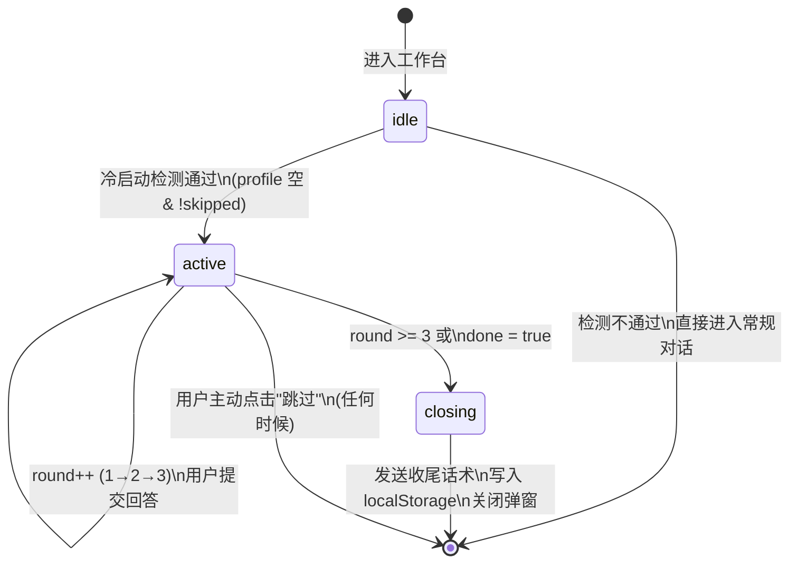
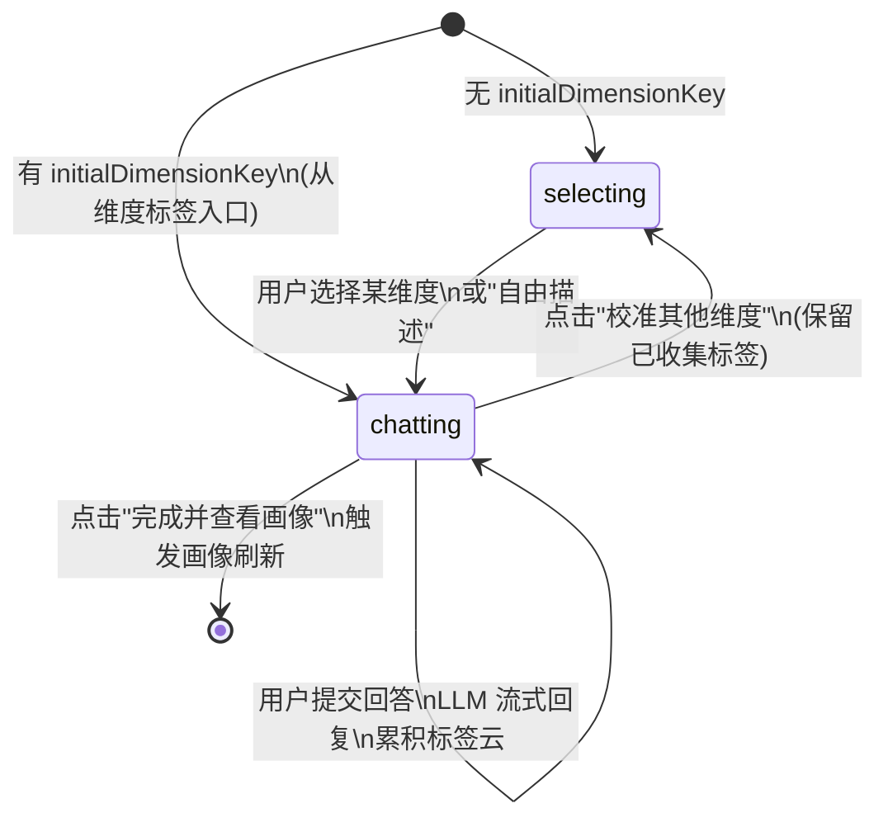

# 冷启动引导向导设计规格（Onboarding Wizard）

> 独立完整规格文档。读者不需要任何前置文档即可理解全部内容。

---

## 1. 背景与目标

### 1.1 要解决的问题

用户第一次进入学习工作台时，系统对用户一无所知。传统做法是让用户填写一份包含 6+ 个维度的调查表单（专业、知识基础、学习目标、认知风格、易错点、资源偏好等）——但这与赛题要求"摒弃传统繁琐表单，通过自然语言对话自动抽取特征"相悖。

如果改用纯对话框自由输入，又面临冷启动的"空文本框尴尬"——用户不知道说什么、怎么说。

因此需要一种介于"表单"和"自由对话"之间的交互形态。

### 1.2 设计目标

1. **摒弃表单感**：用户感知不到"后台有 6 个字段待填"
2. **降低冷启动门槛**：给用户明确的交互入口，而不是空白文本框
3. **保留对话灵魂**：支持用户自由输入，不把路堵死
4. **快速闭环**：3 轮内完成核心维度采集，剩余维度在后续学习中持续抽取
5. **可视反馈**：让用户直观看到"画像正在被构建"，而不是"我在填表"

### 1.3 核心设计原则

**刚性骨架 + 柔性交互**：

```
刚性骨架（后端/Prompt 工程）
  ├─ DB Schema：UserProfile、CourseProfile、ProfileDimension 预设好字段
  ├─ Prompt：system prompt 中指定 dimension key 枚举值
  └─ 推荐引擎：按 knowledge_base / cognitive_style 等固定 key 读取
                    ↓
柔性交互（前端/对话流）
  ├─ 不按字段顺序挨个追问（避免套壳表单感）
  ├─ 将追问嵌入"解决具体学习问题"的服务过程中
  └─ 易错点、学习进度等维度通过后台行为隐式挖掘，不靠问
```

**最高准则**：画像构建是"伴随式成长"的结果，而非"审讯式问答"的产物。字段（Schema）是为后端准备的，自然流畅的痛点解决流程是为学生准备的，两者通过精准的 Prompt 工程解耦。

### 1.4 交互模式总览

借鉴 Codex 风格的"建议卡片 + 自定义输入"混合流：

```text
┌─────────────────────────────────────────────────────┐
│  ✨ 你好！我是你的 AI 学习助手。                      │
│                                                      │
│  为了更好地陪你走过整个大学学习旅程，                  │
│  我需要先简单了解一下你。                             │
│                                                      │
│  你现在主修的专业方向是？                             │
│                                                      │
│  ┌──────────────┐ ┌──────────┐ ┌──────────────┐     │
│  │ 🖥 计算机科学  │ │ 📊 数据科学│ │ ⚙️ 自动化     │     │
│  ├──────────────┤ ├──────────┤ ├──────────────┤     │
│  │ 📡 电子信息   │ │ ➕ 其他   │ │              │     │
│  └──────────────┘ └──────────┘ └──────────────┘     │
│                                                      │
│  ┌──────────────────────────────────────────┐        │
│  │ 输入专业名称...                           │        │
│  └──────────────────────────────────────────┘        │
└─────────────────────────────────────────────────────┘
```

---

## 2. 冷启动检测

### 2.1 触发条件

```text
用户首次进入工作台
  ↓
前端查询：GET /api/v1/profile?scope=global
  ↓
dimensions 为空 或 有效维度 < 3？
  ├─ 是 → 触发冷启动引导流程（ProfileOnboardingWizard）
  └─ 否 → 直接进入常规对话界面
```

### 2.2 不触发的情况

- 用户已完成了引导（localStorage 中有 `completedAt` 标记）
- 用户之前主动跳过了引导（`skipped: true`）
- 全局画像已有 3 个或以上有效维度（置信度 >= 0.4）
- 用户是从资源深链（如 `/resource-hall?type=diagram_pack`）进入，这类场景不需要引导

### 2.3 重复进入保护

引导完成后（无论正常完成还是跳过），30 天内不再触发。localStorage 标记永不自动过期，除非用户清除浏览器数据。

---

## 3. 数据契约

### 3.1 ChipOption（快捷卡片选项）

AI 消息可附带此数据，前端渲染为可点击的药丸按钮。

```typescript
// frontend/src/types/onboarding.ts

export interface ChipOption {
  /** 全局唯一标识，用于埋点追踪 */
  id: string;

  /** 显示文字，如 "计算机科学与技术" */
  label: string;

  /** 可选 emoji 图标，如 "🖥" */
  icon?: string;

  /**
   * 点击后注入输入框的文字。
   * 必须是一句完整的自然语言，如 "我学计算机科学"。
   * 严禁传结构化 code。这是关键约束（见 10.1 Text Injection）。
   */
  payload: string;

  /**
   * 所属画像维度 key。
   * 用于右侧标签云归类。可选值：
   * major_background | knowledge_base | cognitive_style | learning_goal |
   * learning_pace | weakness | resource_preference | expression_preference | learning_habit
   */
  category?: string;

  /** 额外元数据，供 A/B 测试或埋点使用 */
  metadata?: Record<string, string>;
}
```

### 3.2 OnboardingState（引导状态）

```typescript
// frontend/src/types/onboarding.ts

export type OnboardingPhase = 'idle' | 'active' | 'closing';

export interface OnboardingRound {
  /** 轮次序号，从 1 开始 */
  round: number;

  /** AI 本轮发送的问题文本 */
  question: string;

  /** 用户本轮的回答（无论点击还是输入） */
  answer: string;

  /** 本轮抽取到的画像维度 key 列表 */
  extractedDimensions: string[];

  /**
   * 本轮完整对话历史快照。
   * 用于刷新恢复时作为上下文传给后端，使其能无状态地重建适配。
   * 回答被缓存后续刷回到后端的请求中以便无状态恢复（见 13.1）。
   * 格式：OpenAI-style messages array，包含本轮用户消息和 AI 回答。
   */
  history: Array<{ role: 'user' | 'assistant'; content: string }>;
}

export interface OnboardingState {
  /** 是否已跳过引导 */
  skipped: boolean;

  /** 引导阶段 */
  phase: OnboardingPhase;

  /** 当前轮次（1-3） */
  round: number;

  /** 各轮次记录 */
  rounds: OnboardingRound[];

  /** 引导完成时间（ISO 字符串），null 表示未完成 */
  completedAt: string | null;

  /** 当前已经抽取到的维度 key 列表 */
  completedDimensions: string[];

  /** 跳转到的课程 slug（用户在引导中选择了课程时），无则为 null */
  selectedCourseSlug: string | null;
}
```

### 3.3 OnboardingMetadata（后端响应元数据）

**通信方式**：后端在 AI 对话 WebSocket 响应或 REST POST `/chat` 响应中，通过 `meta` 字段传递引导信息。

```typescript
// frontend/src/types/onboarding.ts

/** 后端在 AI 响应中携带的引导元数据 */
export interface OnboardingMetadata {
  /** 是否处于冷启动引导模式 */
  isOnboarding: boolean;

  /** 当前引导轮次（1-3） */
  round: number;

  /** 本轮 AI 消息附带的可点击选项 */
  suggestedChips: ChipOption[];

  /** 引导是否已完成（为 true 时前端应立即关闭引导） */
  done: boolean;

  /** 当前抽取到的维度列表，供标签云渲染 */
  currentDimensions: OnboardingDimensionBrief[];
}

/** 前端标签云使用的精简维度 */
export interface OnboardingDimensionBrief {
  key: string;
  name: string;        // 中文名，如 "专业背景"
  label: string;       // 值，如 "数据科学"
  confidence: number;  // 0-1
}
```

**完整响应格式示例**：

```json
{
  "message": {
    "id": "msg_xxx",
    "role": "assistant",
    "content": "数据科学很有前景！你目前的数学基础处于哪个阶段？"
  },
  "meta": {
    "onboarding": {
      "isOnboarding": true,
      "round": 2,
      "done": false,
      "suggestedChips": [
        {
          "id": "math_basic",
          "label": "正在补微积分/线代",
          "icon": "📖",
          "payload": "我正在补微积分和线性代数的基础",
          "category": "knowledge_base"
        },
        {
          "id": "math_intermediate",
          "label": "常用模型推导没问题",
          "icon": "🧮",
          "payload": "我常用的模型推导没什么问题",
          "category": "knowledge_base"
        },
        {
          "id": "math_advanced",
          "label": "竞赛/强基水平",
          "icon": "🎯",
          "payload": "我参加过数学竞赛，数学基础比较扎实",
          "category": "knowledge_base"
        }
      ],
      "currentDimensions": [
        { "key": "major_background", "name": "专业背景", "label": "数据科学", "confidence": 0.85 }
      ]
    }
  }
}
```

### 3.4 本地存储 Key

```typescript
// frontend/src/constants/storage-keys.ts 追加

/** 引导状态持久化 key */
export const ONBOARDING_STORAGE_KEY = 'zhike_onboarding_state_v1';

/** 引导已完成的标记（localStorage 中存储 completedAt） */
export const ONBOARDING_COMPLETED_KEY = 'zhike_onboarding_completed_v1';
```

---

## 4. 交互流程

### 4.1 三轮对话设计

每轮的 AI 问题、快捷卡片选项、抽取维度需围绕一个核心主题，且随上一轮答案动态适配。

| 轮次 | 核心主题 | AI 问题示例 | 快捷卡片示例 | 目标抽取维度 |
|---|---|---|---|---|
| 第 1 轮 | 专业方向 | 你现在主修的专业方向是？ | 🖥 计算机科学 / 📊 数据科学 / ⚙️ 自动化 / ➕ 其他 | `major_background` |
| 第 2 轮 | 知识基础（动态适配） | [专业]很有前景！你目前的 [相关领域] 基础处于哪个阶段？ | 根据第 1 轮动态生成 | `knowledge_base`、`learning_goal` |
| 第 3 轮 | 痛点挖掘 | 在学习中，你最容易在哪种类型的题目上卡壳？ | 🐛 代码 Debug / 📐 公式推导 / 📝 场景应用 / 🔍 自行补充 | `weakness`、`resource_preference` |

### 4.2 快捷卡片的动态适配规则

第 2 轮的卡片内容必须根据第 1 轮的回答动态变化：

| 第 1 轮回答 | 第 2 轮问题适配 | 第 2 轮卡片适配 |
|---|---|---|
| 计算机科学 | 编程基础处于哪个阶段？ | 🔰 刚学语法 / 🧩 能写小项目 / 🚀 做过完整系统 |
| 数据科学 | 数学基础处于哪个阶段？ | 📖 正在补线代/概率 / 🧮 常用模型推导没问题 / 🎯 竞赛水平 |
| 自动化 | 物理/控制理论基础如何？ | 📐 正在补大学物理 / ⚙️ 经典控制理论掌握 / 🔬 现代控制理论熟悉 |
| 用户自行输入"物理学" | AI 自由判断 + 生成对应卡片 | 根据 LLM 理解生成 |

### 4.3 收尾话术

第 3 轮完成后的关闭话术（由 LLM 动态生成，以下为示例）：

> "我已为你建立初步画像，剩余维度我会在你后续做题和看视频中悄悄学习哦！现在开始你的学习之旅吧！"

### 4.4 跳过入口

任何时候，弹窗右上角或底部提供"跳过引导"按钮：

```text
┌───────────────────────────────────────────┐
│  ✨ 了解你了！                              │
│                                            │
│  ...（AI 消息内容）                         │
│                                            │
│  ┌──────┐  ┌──────────────┐                │
│  │ 发送  │  │ 跳过引导 →   │                │
│  └──────┘  └──────────────┘                │
└───────────────────────────────────────────┘
```

点击跳过后：写入 `skipped: true` → 关闭弹窗 → 进入 AiDialogueCabin 常规界面。

---

## 5. 状态机

### 5.1 状态转换图



### 5.2 状态转换函数

```typescript
// frontend/src/hooks/useOnboardingWizard.ts

type OnboardingAction =
  | { type: 'DETECT_COLD_START'; payload: { profileDimensions: number } }
  | { type: 'SUBMIT_ROUND'; payload: { question: string; answer: string; extractedDimensions: string[]; history: Array<{ role: 'user' | 'assistant'; content: string }> } }
  | { type: 'RECEIVE_META'; payload: { done: boolean; currentDimensions: OnboardingDimensionBrief[] } }
  | { type: 'SKIP' }
  | { type: 'RESTORE'; payload: OnboardingState };

function onboardingReducer(state: OnboardingState, action: OnboardingAction): OnboardingState {
  switch (action.type) {
    case 'DETECT_COLD_START':
      // 全局画像有效维度 < 3 且未跳过 → 激活引导
      if (state.skipped || state.completedAt) return state;
      if (action.payload.profileDimensions >= 3) return { ...state, phase: 'idle' };
      return { ...state, phase: 'active', round: 1 };

    case 'SUBMIT_ROUND': {
      if (state.phase !== 'active') return state;
      if (state.round >= 3) return { ...state, phase: 'closing' };
      const newRound: OnboardingRound = {
        round: state.round,
        question: action.payload.question,
        answer: action.payload.answer,
        extractedDimensions: action.payload.extractedDimensions,
        history: action.payload.history,
      };
      return {
        ...state,
        round: state.round + 1,
        rounds: [...state.rounds, newRound],
        completedDimensions: [
          ...new Set([...state.completedDimensions, ...action.payload.extractedDimensions]),
        ],
      };
    }

    case 'RECEIVE_META':
      if (action.payload.done) {
        return {
          ...state,
          phase: 'closing',
          completedAt: new Date().toISOString(),
        };
      }
      return {
        ...state,
        completedDimensions: action.payload.currentDimensions.map((d) => d.key),
      };

    case 'SKIP':
      return { ...state, skipped: true, phase: 'idle' };

    case 'RESTORE':
      return action.payload;

    default:
      return state;
  }
}
```

### 5.3 持久化规则

| 事件 | 写入 localStorage | 读取时机 |
|---|---|---|
| 引导完成（`closing → [*]`） | `onboardingState` + `completedAt` | 下次进入工作台 |
| 用户跳过 | `skipped: true` | 下次进入工作台 |
| 刷新页面 | 当前 state 已写入 | 从 localStorage 恢复，继续当前轮次 |
| 用户清除浏览器数据 | 丢失 | 重新引导 |
| 超过 30 天未访问 | 不自动过期 | 保留完成状态，不重新引导 |

```typescript
// 持久化辅助函数
function persistOnboarding(state: OnboardingState): void {
  try {
    localStorage.setItem(ONBOARDING_STORAGE_KEY, JSON.stringify(state));
    if (state.completedAt) {
      localStorage.setItem(ONBOARDING_COMPLETED_KEY, state.completedAt);
    }
  } catch {
    // localStorage 不可用时静默失败，不影响核心功能
  }
}

function restoreOnboarding(): OnboardingState | null {
  try {
    const raw = localStorage.getItem(ONBOARDING_STORAGE_KEY);
    if (!raw) return null;
    return JSON.parse(raw) as OnboardingState;
  } catch {
    return null;
  }
}
```

---

## 6. 组件结构

### 6.1 组件树

```
AiDialogueCabin
  ├── 常规渲染路径（phase === 'idle'）
  │   ├── AiDialogueMessageList
  │   ├── AiDialogueSuggestionPanel
  │   └── AiDialogueConsole
  │
  └── 引导渲染路径（phase === 'active' | 'closing'）
      └── ProfileOnboardingWizard（全屏 Overlay，包裹以下内容）
          ├── OnboardingMessageStream（只渲染引导相关消息）
          ├── QuickReplyChipsBar（渲染 ChipOption[]）
          ├── OnboardingTextInput（输入框 + 发送按钮）
          └── ProfileTagCloudSidebar（右侧标签云 + 拼图进度）
```

### 6.2 ProfileOnboardingWizard

全屏引导向导主组件，内部编排各子组件布局。

```typescript
// frontend/src/components/onboarding/ProfileOnboardingWizard.tsx

export interface ProfileOnboardingWizardProps {
  /** 是否可见 */
  open: boolean;

  /** 当前轮次（1-3） */
  round: number;

  /** 各轮消息列表 */
  messages: OnboardingRound[];

  /** 当前轮次的快捷卡片 */
  chips: ChipOption[];

  /** 当前已抽取维度，供标签云展示 */
  dimensions: OnboardingDimensionBrief[];

  /** 总维度目标数（标签云用） */
  totalDimensionTarget: number;

  /** 用户点击卡片或按下回车时触发 */
  onSubmit: (answer: string) => void;

  /** 用户主动输入内容变化时触发 */
  onDraftChange?: (draft: string) => void;

  /** 用户点击跳过 */
  onSkip: () => void;

  /** 引导完成关闭时触发 */
  onClose: () => void;
}
```

**布局示意**：

```text
┌──────────────────────────────────────────────────┐
│  ┌────────────────────┐  ┌────────────────────┐  │
│  │                    │  │  📋 画像速写        │  │
│  │  ✨ AI 消息区域     │  │                    │  │
│  │  （Onboarding      │  │  ┌──────┐ ┌──────┐│  │
│  │   MessageStream）   │  │  │专业  │ │目标  ││  │
│  │                    │  │  │数据科 │ │项目实││  │
│  │                    │  │  │学    │ │践    ││  │
│  │  🖥 计算机科学      │  │  └──────┘ └──────┘│  │
│  │  📊 数据科学        │  │  ┌──────────┐     │  │
│  │  ⚙️ 自动化          │  │  │ 知识基础  │     │  │
│  │  （QuickReplyChips)│  │  │ 微积分薄弱 │     │  │
│  │                    │  │  └──────────┘     │  │
│  │  ┌───────────┐   │  │  ■■■□□□ 3/6       │  │
│  │  │ 输入框...  │   │  │  （ProfileTagCloud)│  │
│  │  └───────────┘   │  └────────────────────┘  │
│  │  （OnboardingTextInput)│                      │
│  └────────────────────┘                         │
└──────────────────────────────────────────────────┘
```

### 6.3 QuickReplyChipsBar

```typescript
// frontend/src/components/onboarding/QuickReplyChipsBar.tsx

export interface QuickReplyChipsBarProps {
  /** 快捷卡片列表 */
  chips: ChipOption[];

  /** 用户点击卡片时触发 */
  onChipClick: (payload: string) => void;

  /** 是否可见（用户打字时隐藏） */
  visible: boolean;

  /**
   * 卡片是否正在加载中（WebSocket 流式传输时，meta.onboarding
   * 可能在文本流结束后才返回）。加载态显示灰色骨架屏占位，
   * 防止文本渲染后突然"啪"地弹出按钮造成布局抖动。
   */
  loading: boolean;
}

// 点击行为（Text Injection 模式）：
// 1. 将 chip.payload 填充到输入框
// 2. 延迟 100ms 后自动提交
// 3. 不清除 chips 列表（等待下一轮响应替换）

// 骨架屏占位规则：
// - loading=true 且 visible=true 时：渲染 3 个灰色 Pill Skeleton
// - loading=false 且 chips.length > 0：平滑渐显真实卡片（CSS opacity 过渡 300ms）
// - loading=false 且 chips.length === 0：不渲染任何内容（不显示骨架屏）
```

### 6.4 OnboardingTextInput

```typescript
// frontend/src/components/onboarding/OnboardingTextInput.tsx

export interface OnboardingTextInputProps {
  /** 占位符文字 */
  placeholder?: string;

  /** 输入框内容 */
  value: string;

  /** 是否禁用 */
  disabled?: boolean;

  /** 输入变化回调 */
  onChange: (value: string) => void;

  /** 用户提交回调（回车或点击发送） */
  onSubmit: (value: string) => void;
}

// 行为约束：
// - value 从非空变为空 → 恢复 chips 显示
// - value 从空变为非空 → 隐藏 chips
// - 提交后清空输入框
```

### 6.5 OnboardingMessageStream

```typescript
// frontend/src/components/onboarding/OnboardingMessageStream.tsx

export interface OnboardingMessageStreamProps {
  /** 各轮消息 */
  messages: OnboardingRound[];

  /** 当前轮次（用于高亮最新轮次） */
  currentRound: number;
}

// 消息渲染规则：
// - 只渲染文本内容和轮次序号
// - 不包含资源卡片、引用、溯源等复杂元素
// - 用户消息和 AI 消息交替显示
// - 支持打字机效果（流式渲染最后一条 AI 消息）
```

### 6.6 ProfileTagCloudSidebar

```typescript
// frontend/src/components/onboarding/ProfileTagCloudSidebar.tsx

export interface ProfileTagCloudSidebarProps {
  /** 当前已抽取的维度 */
  dimensions: OnboardingDimensionBrief[];

  /** 总目标维度数（进度条分母） */
  totalTarget: number;

  /** 新维度飞入动画的标识符，维度 key 变化时触发 */
  animationKey?: string;
}
```

**渲染逻辑**：

- 每个维度渲染为一个标签卡片，显示 `name` + `label`
- 新加入的维度带飞入动画（CSS `@keyframes` 或 Framer Motion）
- 顶部进度条：`已完成数 / 总目标数`，用拼图图标表示
- 维度按置信度排序，高置信靠前
- 总目标数固定 6（不因实际维度数变化）

---

## 7. 后端集成

### 7.1 后端工作流修改

后端不需要新增 endpoint。现有对话流在 `AgentWorkflow._node_profile` 节点中添加以下逻辑：

```
收到用户消息
  ↓
检查当前消息是否首次（profile 空）
  ├─ 是 → 进入引导模式
  │       1. system prompt 注入引导指令（见第 11 章）
  │       2. LLM 输出附带 suggestedChips + 引导轮次
  │       3. response.meta.onboarding = { isOnboarding: true, ... }
  │
  └─ 否 → 常规画像抽取路径
           response.meta.onboarding = null
```

#### 7.1.1 WebSocket 入口分流（关键）

`/ws/ai/{conversation_id}` 在调用 `orchestrator.handle_message` 之前，必须先检测引导条件。命中则走 `workflow.stream_chat` 流式输出（含完整 onboarding 逻辑），否则保持原 `handle_message` 非流式路径：

```python
chat_request = payload.to_chat_request()
should_stream_onboarding = is_general_learning(chat_request) and (
    bool(chat_request.onboarding_history)
    or bool(getattr(chat_request, "force_onboarding", False))
    or OnboardingService(db).is_cold_start(current_user.id)
)
if should_stream_onboarding:
    async for event in workflow.stream_chat(chat_request, db, current_user.id):
        await websocket.send_json(jsonable_encoder(event))
else:
    response = await orchestrator.handle_message(payload, db, current_user.id)
    # ... 原 session_started / text_delta / done 发送逻辑
```

`stream_chat` 内部完成：cold_start 检测 → LLM 结构化 JSON 返回解析 → `user_visible` 打字机 yield → `dimensions` 直写全局画像（`source_type="onboarding_llm"`）→ `onboarding_update` 事件 → `done` 帧（含 `meta.onboarding`）。

> 注意：`stream_chat` 是引导模式的唯一有效入口。若 WebSocket 仅调用 `handle_message`（走 `run_chat`），则冷启动检测、结构化返回、`onboarding_update`、`done.meta.onboarding` 均不生效，自由输入路径引导完全不工作。

#### 7.1.2 `_node_profile` 在引导模式下的行为

引导模式下，`dimensions` 已由 `stream_chat` 通过 `_parse_onboarding_structured_answer` 直写画像。`_node_profile` 检测 `state["onboarding_dimensions_written"]` 标记，为真时跳过 `ProfileExtractor`，仅 `record_session_evidence` 保留本轮对话作为画像证据，避免重复抽取。

### 7.2 后端判断首次的逻辑

后端判断"是否首次"的标准：

1. 该用户 `ProfileDimension` 表中 `profile_scope='global'` 的记录数 < 3
2. 或所有全局维度的置信度均 < 0.4
3. 同时满足 `weakness` 维度未被抽取过（冷启动阶段不应该有易错点信息）

### 7.3 后端返回 chips 的 Prompt 控制

```text
你当前处于"冷启动引导模式"，请遵循以下规则：

1. 当前是第 {round} 轮（最多 3 轮），请围绕一个核心主题提问；
2. 在 JSON 输出的 extra 字段中提供 suggestedChips，每轮最多 4 个选项；
3. 第 2 轮的问题和 chips 必须基于第 1 轮的答案动态适配；
4. 每个 chip 的 payload 必须是一句完整的自然语言（如"我学计算机科学"），
   禁止使用 code、id 或缩写；
5. 已抽取过的维度（在当前维度的 {currentDimensions} 中）不要重复提问；
6. 第 3 轮 if round === 3 且 question 已答完，设置 done = true。
```

### 7.4 meta.onboarding 传输时机约定

后端在对话 WebSocket 或 REST 响应中携带 `meta.onboarding` 时，必须遵循以下时序约定，以避免用户看到"文本打完了突然啪地弹出一排按钮"的布局抖动（Layout Shift）：

| 传输时机 | 适用场景 | 约束 |
|---|---|---|
| **首帧（SSE header / 首条消息）** | REST 模式 | `meta.onboarding` 必须在第一条响应帧中携带，与 `message` 同时到达 |
| **onboarding_update 事件** | WebSocket 模式（`stream_chat`） | 文本打字机输出结束后、`done` 帧之前，单独发送 `{type: "onboarding_update", meta: {onboarding: {...}}}`，前端可提前渲染 chips |
| **done 帧兜底** | WebSocket 模式 | `done` 帧 `meta.onboarding` 与 `onboarding_update` 内容一致，作为前端 `handleStreamDone` 的兜底来源 |

**WebSocket 模式下的前端防抖策略**：

1. 前端 `QuickReplyChipsBar` 拿到 `loading=true` 状态后，渲染灰色骨架屏占位（3 个灰色 pill，高度与真实卡片一致）；
2. 文本流持续渲染期间，骨架屏始终可见，占据按钮即将出现的区域；
3. 后端流式结束后返回 `meta.onboarding` → 前端收到后用渐变过渡（CSS opacity 300ms）替换骨架屏为真实卡片；
4. 这样无论后端何时返回 chips，视觉上卡片区域始终"被占住"，不会出现布局抖动。

```text
时序示意（WebSocket）：

time ──────────────────────────────────────────────────→

  ┌── 流式文本开始 ──┬── 文本字字渲染 ──┬── 流式文本结束 ──┐
  │                  │                  │                  │
  │  meta.onboarding │  用户看到文字    │  chips 就绪      │
  │  = null          │  骨架屏占位      │  → 渐显卡片      │
  │  骨架屏可见       │                  │  骨架屏消失      │
  └──────────────────┴──────────────────┴──────────────────┘
```

### 7.5 用户自定义输入的二级类目兜底索引

当用户在第 1 轮选择了 "其他" 或自行输入了非预设专业（如 "物理学"），第 2 轮需要 LLM 即时推理生成适配问题 + chips。这会带来两个风险：

1. **TTFT（首字延迟）显著增加** — LLM 需要即兴策划卡片内容，无法复用 Prompt 缓存；
2. **LLM 生成失败** — chips 为空数组，前端退化为纯输入框，体验断崖下跌。

**兜底策略**：

后端维护一个轻量**专业二级类目索引**（硬编码 JSON，约 30 行），当 LLM 自由判断未完成或超时时，规则层优先吐出该类目的通用卡片作为兜底：

```typescript
// backend/app/data/major-categories.ts
export const MAJOR_CATEGORY_FALLBACK_CHIPS: Record<string, ChipOption[]> = {
  "工学": [
    { id: "eng_math", label: "高等数学/线性代数", payload: "我工科数学基础还可以" },
    { id: "eng_prog", label: "编程基础（C/Python）", payload: "我有一定的编程基础" },
  ],
  "理学": [
    { id: "sci_math", label: "数学分析/高等代数", payload: "我数理基础比较扎实" },
    { id: "sci_phys", label: "普通物理", payload: "我物理基础需要补一下" },
  ],
  "人文社科": [
    { id: "hum_reading", label: "文献阅读与综述", payload: "我文献阅读能力还行" },
    { id: "hum_stat", label: "统计学基础", payload: "我需要补一下统计基础" },
  ],
  "商学": [
    { id: "bus_eco", label: "经济学基础", payload: "我经济学基础不错" },
    { id: "bus_stat", label: "统计学/计量", payload: "我统计基础需要加强" },
  ],
  // ... 其他类目
};

// 类目判定规则（关键词匹配）：
// "物理" / "化学" / "生物" / "数学" → "理学"
// "计算机" / "电子" / "机械" / "自动化" → "工学"
// "文学" / "历史" / "哲学" / "社会学" → "人文社科"
// "金融" / "会计" / "管理" → "商学"
// 以上都不匹配 → "通用"（显示通用学习风格卡片）
```

**LLM + 规则双通道时序**：

```text
用户输入 "物理学"
  ↓
并行触发：
  ├─ 通道 A（LLM）：即时推理 → 生成适配 chips
  │   └─ 成功 → 使用 LLM chips
  │   └─ 超时/失败 → 静默丢弃
  │
  └─ 通道 B（规则）：关键词匹配 → "理学" → 取出通用理学卡片
      └─ 立即返回给前端作为初始 chips
          └─ 如果 LLM 通道后来成功 → 逐步替换规则卡片
```

这样前端永远不会因为 LLM 推理延迟而显示空卡片区域。
```

---

## 8. 集成点

### 8.1 现有文件修改清单

| 文件 | 修改内容 | 影响范围 |
|---|---|---|
| `frontend/src/types/index.ts` | 导出 `onboarding.ts` 的类型 | 新增文件 → 索引导出 |
| `frontend/src/stores/conversation.store.ts` | `WorkspaceChatMessage` 追加可选 `meta?: { onboarding?: OnboardingMetadata }` | 向后兼容 |
| `frontend/src/app/AiDialogueCabin.tsx` | 引入 `useOnboardingWizard` hook；根据 `showWizard` 条件渲染 `ProfileOnboardingWizard` 或常规组件 | 关键修改 |
| `frontend/src/hooks/useAiDialogueChatStreamLifecycle.ts` | 解析响应中的 `meta.onboarding`，通过回调传给 AiDialogueCabin | 中等 |
| `frontend/src/constants/storage-keys.ts` | 追加 `ONBOARDING_STORAGE_KEY`、`ONBOARDING_COMPLETED_KEY` | 低 |

### 8.2 现有文件无需修改

| 文件 | 原因 |
|---|---|
| `AiDialogueMessageList.tsx` | 引导阶段不经过此组件，消息由 `OnboardingMessageStream` 渲染 |
| `AiDialogueConsole.tsx` | 引导阶段不经过此组件，输入框由 `OnboardingTextInput` 提供 |
| `AiDialogueSuggestionPanel.tsx` | 引导阶段不经过此组件，快捷卡片由 `QuickReplyChipsBar` 提供 |
| 后端所有路由/模型/服务文件 | 引导流走现有对话接口，后端只需在 response meta 中携带 chips |

### 8.3 冷启动检测 Hook（完整实现）

```typescript
// frontend/src/hooks/useOnboardingWizard.ts

export function useOnboardingWizard(options: {
  profileDimensions: number;  // 从 GET /api/v1/profile 获取
  loading: boolean;
}): {
  state: OnboardingState;
  dispatch: React.Dispatch<OnboardingAction>;
  showWizard: boolean;
} {
  const [state, dispatch] = useReducer(onboardingReducer, initialState);

  // 1. 尝试从 localStorage 恢复状态
  useEffect(() => {
    if (options.loading) return;
    const saved = restoreOnboarding();
    if (saved) {
      dispatch({ type: 'RESTORE', payload: saved });
    } else {
      dispatch({
        type: 'DETECT_COLD_START',
        payload: { profileDimensions: options.profileDimensions },
      });
    }
  }, [options.loading, options.profileDimensions]);

  // 2. 持久化（state 变化时写入 localStorage）
  useEffect(() => {
    if (state.phase !== 'idle') {
      persistOnboarding(state);
    }
  }, [state]);

  const showWizard = state.phase === 'active' || state.phase === 'closing';

  return { state, dispatch, showWizard };
}
```

---

## 9. 前后端刚性开发契约

> 本章是核心约束。违反任意一条即视为功能缺陷，必须修复才能合入。

### 9.1 契约一：前端必须每轮持久化 history 快照

**约束等级**：MUST — 不可协商。

```text
每次用户提交回答（SUBMIT_ROUND）后，frontend/src/hooks/useOnboardingWizard.ts 中的
persistOnboarding() 必须将包含完整 history[] 的 OnboardingState 写入 localStorage。
```

**三行实现规则**：

```typescript
function persistOnboarding(state: OnboardingState): void {
  // 规则 1：无论 phase 是 active 还是 closing，只要 rounds 有变化就全量写入
  // 规则 2：禁止只写部分字段（如只写 round 不写 history）
  // 规则 3：禁止在写入前对 history 做截断、脱敏或省略
  try {
    localStorage.setItem(ONBOARDING_STORAGE_KEY, JSON.stringify(state));
    if (state.completedAt) {
      localStorage.setItem(ONBOARDING_COMPLETED_KEY, state.completedAt);
    }
  } catch {
    // localStorage 不可用时静默失败
  }
}
```

**单元测试验证点**：

```typescript
describe('useOnboardingWizard persistOnboarding', () => {
  it('每轮提交后 localStorage 中的 OnboardingState.rounds[].history 不为空', () => {
    // 模拟 3 轮提交
    // 验证 localStorage.getItem(ONBOARDING_STORAGE_KEY) 的每个 round 都有 history
  });

  it('不允许写入不包含 history 的残缺 state', () => {
    // 模拟不完整的 payload 提交，验证 reducer 拒绝
  });

  it('刷新后从 localStorage 恢复的 history 数组完整可遍历', () => {
    // 模拟写入 → 清除内存 → restoreOnboarding() → 验证
  });
});
```

**违反后果**：用户刷新页面后，后端收到空的 `onboarding_history`，无法重建上下文，LLM 误判为全新对话，回到第 1 轮。属于**数据丢失类缺陷**。

---

### 9.2 契约二：后端必须无状态重建，零依赖 session

**约束等级**：MUST — 不可协商。

```text
后端收到包含 onboarding_history 的请求时，必须：
  1. 仅依赖请求参数中的 history 数组重建 LLM 上下文；
  2. 不查询任何服务器端 session、缓存或临时存储；
  3. 不依赖 WebSocket 连接的存活状态；
  4. 不假设 LLM 调用间有任何共享状态。
```

**后端接口定义**：

当用户刷新后恢复引导时，前端发送的消息必须携带完整的 `onboarding_history`：

```json
{
  "message": "我选数据科学",
  "course_id": "general",
  "onboarding_history": [
    {"role": "user", "content": "我选计算机科学"},
    {"role": "assistant", "content": "计算机科学很有前景！你目前的编程基础处于哪个阶段？"},
    {"role": "user", "content": "我能写小项目"}
  ]
}
```

**后端 LLM Prompt 注入规则**（优先于 10.1 的通用引导指令）：

```text
=== 恢复模式（优先）===
1. 用户因刷新页面重新发起引导请求，下方 onboarding_history 是本次对话已完成的轮次；
2. 基于 history 判断当前应进入第 N 轮，不要重复提问 history 中已有的内容；
3. 如果第 1 轮用户选择了"计算机科学"，不要在第 2 轮再问"你的专业是什么"；
4. 忽略 history 中用户可能产生的自我矛盾，以最新一条 history 的内容为准。
```

**测试验证**：

```text
场景 A：
  请求体：onboarding_history 有 2 轮完整记录（专业 + 知识基础）
  预期：LLM 输出第 3 轮（痛点挖掘）的问题 + chips，不回溯第 1/2 轮

场景 B：
  请求体：onboarding_history 有第 1 轮记录，但第 2 轮为空
  预期：LLM 基于第 1 轮生成第 2 轮问题，不因为第 2 轮空缺而回到第 1 轮

场景 C：
  请求体：onboarding_history 为空数组（极端情况）
  预期：降级为全新引导（round=1），不报错
```

**违反后果**：用户刷新后后端返回第 1 轮问题，用户被迫重复回答。属于**体验断裂类缺陷**。

---

## 10. 关键行为约束

### 10.1 Text Injection（点击即文本注入）

这是区分"真智能"与"假对话"的关键技术约束。引导态提供两条提交路径，分工明确：

**路径 A — 预设 chip 点击（不走 LLM，后端直接写画像）**：

```text
❌ 错误做法：
  前端 → 后端：{ "code": "data_science" }
  // 大模型收到的是 code，无法进行语义理解，退化为硬编码映射

✅ 正确做法（Text Injection）：
  前端 → 输入框填充文字 → 自动点击发送
  后端 → 大模型收到的消息：{ "content": "我选数据科学" }
  // 大模型始终处理自然语言，走统一 LLM 语义理解管道
```

预设 chip 的 `payload` 本身就是完整自然语言句子（如"我学计算机科学"），前端点击后由 `useOnboardingDialogue.submitPresetChip` 提交，后端 `OnboardingService.apply_preset_chip` 直接写入对应画像维度并返回模板话术 + 下一轮 chips，**不调用 LLM**，保证低延迟。

**路径 B — 自由输入（走 LLM 结构化 JSON 返回）**：

用户在输入框主动打字提交时，由 `useOnboardingDialogue.submitFreeInput` 触发 WebSocket 流式请求，后端 `workflow.stream_chat` 识别 `onboarding_mode` 后：
1. 注入 `build_onboarding_system_prompt` 约束 LLM 返回结构化 JSON（schema：`user_visible` + `dimensions` + `chips`）；
2. 缓冲完整 answer 后由 `_parse_onboarding_structured_answer` 解析；
3. `user_visible` 分块打字机 yield 给前端；
4. `dimensions` 直写全局画像（`source_type="onboarding_llm"`，跳过 extractor 避免重复抽取）；
5. `chips` 设置到 `onboarding_service._llm_chips`，供第 2 轮起 `build_chips` 优先消费。

```typescript
// 路径 A 前端实现
function handleChipClick(payload: string) {
  setDraft(payload);                       // 1. 填充输入框（用户可见）
  setTimeout(() => submitPresetChip(), 100); // 2. 自动提交预设 chip（不走 LLM）
}

// 路径 B 前端实现
function handleFreeInputSubmit(text: string) {
  submitFreeInput(text);                   // 走 WebSocket 流式 LLM
}
```

### 9.2 用户输入优先于卡片点击

当用户在输入框主动打字时：

1. 自动隐藏当前快捷卡片（通过 `visible` prop）
2. 用户输入的内容视为"自定义回答"，优先级高于之前点击的卡片
3. 后端 system prompt 中需明确："用户主动输入的内容权重最高，覆盖之前的点击选择"

### 9.3 3 轮封顶

冷启动弹窗中最多进行 3 轮"点击/输入"交互。3 轮之后不论画像维度是否齐全：

1. 自动进入 `closing` 阶段
2. AI 发送收尾话术
3. 2 秒后自动关闭弹窗
4. 写入 localStorage `completedAt`
5. 进入 AiDialogueCabin 常规界面

### 9.4 引导阶段的视觉隔离

引导阶段和常规对话阶段必须视觉隔离：

- 引导阶段：取消全屏 Overlay，引导消息挂进 AiDialogueCabin 对话流，但保留引导态视觉差异（精简工作台、入场动画、独立气泡样式）；右侧标签云改为可折叠抽屉，新维度抽取时自动弹出 2.5s 后收回
- 常规阶段：现有 AiDialogueCabin 布局不变
- 引导态下非引导消息被 UI 隔离硬性拦截（不切换为常规对话）
- 引导完成或跳过后触发粒子消散转场（24 粒子纯 CSS，1.2s），常规元素以 staggered 动画入场（0.8s）

半融入方案的取舍：放弃全屏 Overlay 的强仪式感，换取引导内容与常规对话流的视觉连续性，降低用户感知到的"模式切换"割裂。`AiDialogueCabin` 通过 `showWizard` 条件渲染二选一：引导态显示 `ProfileOnboardingWizard`，非引导态显示 `AiDialogueMessageList + AiDialogueConsole`。

---

## 11. Prompt 控制

### 11.1 引导阶段 system prompt 注入内容

后端在检测到冷启动时，向 LLM system prompt 注入以下指令：

```text
你当前处于"冷启动引导模式"，请遵循以下规则：

=== 画像抽取约束 ===
1. 每轮只抽取当前轮次明确出现的维度，不追问未提及字段；
2. 已获取字段清单（见下方 currentDimensions）严禁重复提问；
3. 优先询问对学习路径规划影响最大的维度（专业背景、知识基础、学习目标），
   而非边缘维度（学习习惯、表达偏好）；
4. 用户主动输入的内容权重高于点击卡片的选择；
5. 3 轮后自动结束引导，即使维度不全；
6. 剩余维度标注为 "待观察" 或留空，在后续交互中持续抽取。

=== 快捷卡片约束 ===
1. 每轮附带 2-4 个 suggestedChips；
2. 每个 chip 的 payload 必须是完整的自然语言句子；
3. 第 2 轮的 chips 必须根据第 1 轮答案动态适配，不能所有用户都显示相同选项；
4. 当用户选取 "其他" 或输入自定义内容时，chips 中不出现 "其他" 选项。

=== 输出格式 ===
你必须在 JSON 输出的 extra 字段中包含：
{
  "suggestedChips": [...],
  "currentDimensions": [...],
  "done": false,
  "round": 1
}
```

### 11.2 常规阶段 system prompt 注入内容

后端检测到非冷启动时，注入常规画像抽取指令（现有逻辑，与引导模式无关）。

---

## 12. 新文件清单

| 文件路径 | 内容 | 新增/修改 |
|---|---|---|
| `frontend/src/types/onboarding.ts` | `ChipOption`、`OnboardingState`、`OnboardingMetadata`、`OnboardingDimensionBrief`、`OnboardingRound`、`OnboardingPhase` 等类型定义 | **新增** |
| `frontend/src/hooks/useOnboardingWizard.ts` | `onboardingReducer`、`useOnboardingWizard` hook、`persistOnboarding`/`restoreOnboarding` 辅助函数 | **新增** |
| `frontend/src/components/onboarding/ProfileOnboardingWizard.tsx` | 全屏引导向导主组件（编排消息流 + 快捷卡片 + 输入框 + 标签云布局） | **新增** |
| `frontend/src/components/onboarding/QuickReplyChipsBar.tsx` | `ChipOption[]` 列表渲染，点击触发 Text Injection | **新增** |
| `frontend/src/components/onboarding/OnboardingTextInput.tsx` | 引导专用输入框，监听 `value` 变化自动隐藏 chips | **新增** |
| `frontend/src/components/onboarding/OnboardingMessageStream.tsx` | 引导消息列表（精简渲染，无资源卡片等复杂元素） | **新增** |
| `frontend/src/hooks/useOnboardingDialogue.ts` | 引导对话编排：Text Injection、流式渲染、刷新恢复、onboarding_history 回传 | **新增** |
| `frontend/src/components/onboarding/ProfileTagCloudSidebar.tsx` | 右侧标签云实时展示 + 拼图进度 + 飞入动画 | **新增** |
| `frontend/src/constants/storage-keys.ts` | 追加 `ONBOARDING_STORAGE_KEY`、`ONBOARDING_COMPLETED_KEY` | **修改** |
| `frontend/src/stores/conversation.store.ts` | `WorkspaceChatMessage` 追加 `meta` 可选字段 | **修改** |
| `frontend/src/app/AiDialogueCabin.tsx` | 集成 `useOnboardingWizard` + 条件渲染 `ProfileOnboardingWizard` | **修改** |
| `frontend/src/hooks/useAiDialogueChatStreamLifecycle.ts` | 解析响应中的 `meta.onboarding` 并回调给 cabin | **修改** |

---

## 13. 错误处理

### 13.1 错误场景与恢复策略

| 场景 | 表现 | 恢复策略 |
|---|---|---|
| 后端返回普通内容（非引导格式） | `meta.onboarding` 缺失或 `isOnboarding: false` | 前端关闭引导，进入常规对话。不报错，视为"后端判定无需引导" |
| API 请求超时/网络断开 | `loading` 持续为 true | 显示加载骨架屏。30 秒超时后显示"加载失败，重试"按钮。不自动跳过引导 |
| 用户在第 2 轮刷新页面 | 前 2 轮消息丢失。后端失去了上一轮的流式上下文，无法无状态地"凭空"生成第 2 轮适配问题 | 从 localStorage 恢复 `OnboardingState.rounds`，提取 `history[]` 作为上下文重新传给后端。后端对引导请求增加 `onboarding_history` 参数，LLM 基于完整历史重新生成第 2 轮问题，不走第 1 轮 |
| LLM 自由生成 chips 超时 | 用户输入非预设专业（如"物理学"），LLM 需要即兴推理生成适配卡片，TTFT 显著增加 | 后端启动双通道：通道 A（LLM）即时推理 + 通道 B（规则层专业类目兜底索引）并行。规则通道立即返回通用卡片，LLM 成功后逐步替换（见 7.5） |
| LLM 解析异常，chips 为空数组 | `suggestedChips: []` | 前端隐藏快捷卡片区域，只保留输入框。用户可自行输入回答 |
| 用户连续 2 次提交相同内容 | 两次 `SUBMIT_ROUND` 的 `answer` 完全一致 | 后端检测并返回 `duplicate: true`，前端显示"这个问题已经回答过了，要换个角度聊聊吗？" |
| 用户输入与点击矛盾 | 先点"计算机科学"，再输入"我是学历史的" | 用户主动输入权重最高。后端 system prompt 约束：以最新输入为准，覆盖之前的点击选择 |
| OnboardingState JSON 解析失败 | `JSON.parse` 异常 | 静默失败，放弃恢复，走全新引导流程。不阻塞用户进入 |
| localStorage 不可用 | `setItem` 异常（隐私模式或无痕模式） | 捕获异常，引导功能降级为纯对话模式（无持久化），但仍可正常工作 |

### 13.2 兜底降级路径

```mermaid
flowchart TD
    A[启动引导] --> B{后端返回 chips?}
    B -->|有 chips| C[渲染快捷卡片 + 输入框]
    B -->|空数组| D[只渲染输入框]
    C --> E{用户 30 秒无操作?}
    D --> E
    E -->|是| F[显示提示：\n"不知道该说什么？试试随便聊聊你的专业或目标"]
    E -->|否| G[正常提交]
    F --> G
    G --> H{round >= 3?}
    H -->|是| I[关闭引导]
    H -->|否| A
```

---

## 14. 完整状态转换图

### 14.1 前端视角

```
                    ┌──────────────────────────────┐
                    │  进入 AiDialogueCabin          │
                    │  加载 GET /api/v1/profile     │
                    └──────────┬───────────────────┘
                               │
                    ┌──────────▼───────────────────┐
                    │  有效维度 >= 3 或 skipped?     │
                    └──────┬──────────────┬────────┘
                     是    │              │  否
                    ┌──────▼──┐    ┌──────▼──────────────┐
                    │ idle    │    │ active (round=1)     │
                    │ 常规对话 │    │ 弹出 OnboardingWizard│
                    └─────────┘    └──────┬──────────────┘
                                          │
                               ┌──────────▼──────────────┐
                               │ 发送消息（点击/输入）      │
                               │ → 后端返回 meta.onboarding│
                               └──────────┬──────────────┘
                                          │
                    ┌─────────────────────▼─────────────────────┐
                    │           后端 Response 解析               │
                    ├───────────────────────────────────────────┤
                    │ meta.onboarding.done = true?              │
                    │   ├─ 是 → phase = closing, round 固定     │
                    │   └─ 否 → round++, 更新 chips + dimensions│
                    └─────────────────────┬─────────────────────┘
                                          │
                    ┌─────────────────────▼─────────────────────┐
                    │     round >= 3 或 done = true?             │
                    └──────────┬──────────────────┬──────────────┘
                      否       │                  │  是
                    ┌──────────▼──┐    ┌──────────▼──────────────┐
                    │ 继续 active  │    │ closing                 │
                    │ 等待下一轮   │    │ 显示收尾话术            │
                    └─────────────┘    │ 2 秒后自动关闭           │
                                       │ 写入 localStorage        │
                                       └──────────┬──────────────┘
                                                  │
                                        ┌─────────▼─────────┐
                                        │ idle (引导结束)     │
                                        │ 进入常规对话        │
                                        └───────────────────┘
```

### 14.2 后端视角

```text
收到用户消息
  ↓
检查用户 ProfileDimension 全局维度记录数 < 3
  ├─ 是 → 进入引导模式
  │       1. system prompt 注入冷启动引导指令（见第 11 章）
  │       2. LLM 输出附带 suggestedChips 和引导轮次
  │       3. 后端组装 response.meta.onboarding = { ... }
  │       4. 走常规画像抽取管道，确保维度写入 profile 表
  │
  └─ 否 → 常规画像抽取路径
           response.meta.onboarding = null
```

---

## 15. 验收条件

实现完成后，以下场景必须全部通过：

| 编号 | 验收场景 | 预期结果 | 验证方式 |
|---|---|---|---|
| 1 | **冷启动触发**：新用户首次进入工作台，全局画像为空 | 弹出 `ProfileOnboardingWizard`，显示第 1 轮问题和快捷卡片 | 可视化 + 控制台 |
| 2 | **3 轮封顶**：完成 3 轮交互 | 自动关闭引导，进入常规对话 | 可视化 |
| 3 | **提前跳过**：用户在第 2 轮点击"跳过" | 引导关闭，进入常规对话，localStorage 写入 `skipped: true` | localStorage 检查 |
| 4 | **刷新恢复**：用户在第 2 轮刷新页面 | 重新弹出引导，恢复第 2 轮（不回到第 1 轮） | 可视化 |
| 5 | **Text Injection 验证**：点击卡片发送消息 | 开发者工具 Network 面板显示发送内容为自然语言，非结构化 code | Network 面板 |
| 6 | **标签云更新**：每轮完成后 | 右侧标签云新增对应标签，拼图进度更新 | 可视化 |
| 7 | **隐藏卡片**：用户在输入框打字 | 快捷卡片自动隐藏 | 可视化 |
| 8 | **后端降级**：后端返回 `suggestedChips: []` | 前端只显示输入框，不报错 | 可视化 + 控制台 |
| 9 | **网络超时**：API 超时 | 显示重试按钮，不自动跳过引导 | 可视化 |
| 10 | **二次进入不重复触发**：引导完成后关闭页面→重新进入 | 不再弹出引导 | 可视化 |
| 11 | **第 2 轮动态适配**：第 1 轮选不同答案 | 第 2 轮的 chips 内容不同 | 可视化 |
| 12 | **用户输入覆盖点击**：先点卡片再输入自定义内容 | 后端以最新输入为准 | API 响应检查 |

---

## 16. 实施优先级

| Phase | 内容 | 工作量 | 依赖 |
|---|---|---|---|
| **P0** | 冷启动检测 Hook + 3 轮状态机 + `ProfileOnboardingWizard` 基础布局 + `QuickReplyChipsBar` + `OnboardingTextInput` | 3 天 | 现有 `ProfileExtractor`、`AiDialogueSuggestionPanel` |
| **P1** | `OnboardingMessageStream` + Text Injection 模式 + 自动隐藏卡片 + 后端 `meta.onboarding` 集成 | 1.5 天 | P0 |
| **P2** | `ProfileTagCloudSidebar` + 拼图进度 + 标签飞入动画 + `closing` 阶段收尾动画 | 2 天 | P0 |
| **P3** | 毛玻璃全屏弹窗 + 入口粒子动画 + 键盘快捷键（ESC 跳过） | 2 天 | P0-P2 |

---

## 17. 对话式画像自主校准（CalibrateModal）

> 本章描述已校准用户主动重新校准画像的交互模式，与第 1-16 章的冷启动引导（`ProfileOnboardingWizard`）互补。冷启动引导解决"首次进入一无所知"，对话式校准解决"已有画像但想调整某个维度"。

### 17.1 与冷启动引导的区别

| 维度 | 冷启动引导（ProfileOnboardingWizard） | 对话式校准（CalibrateModal） |
|---|---|---|
| 触发时机 | 首次进入工作台，全局画像维度 < 3 | 用户主动点击维度标签或"重新校准"按钮 |
| 入口位置 | AiDialogueCabin 全屏 Overlay | LearningProfilePage Modal 弹窗 |
| 对话流程 | 固定 3 轮（专业→知识基础→痛点） | 维度驱动，可多轮，每轮围绕用户选定的维度 |
| chips 来源 | 后端 LLM 动态生成（第 2/3 轮） | 前端 `dimensionChips.ts` 维度专属预设 |
| 画像写入 | `AgentWorkflow._node_profile` 自动抽取 | 同样走 `AgentWorkflow._node_profile`，复用 WebSocket 通道 |
| 状态持久化 | localStorage（`ONBOARDING_STORAGE_KEY`） | 无需持久化（每次校准独立） |
| 标签云 | `ProfileTagCloudSidebar`（6 维度拼图） | 复用 `ProfileTagCloudSidebar`（本轮已校准维度） |

### 17.2 触发入口

学习画像页（`/learning-profile`）提供三类入口，均打开 `CalibrateModal`：

```text
入口 1：维度标签按钮（主要入口）
  ProfileOverviewPanel 顶部的维度标签（如"专业背景：未设定"）
  → 点击直接进入该维度的对话式校准
  → 跳过维度选择阶段，initialDimensionKey 已设定

入口 2：深度维度卡片
  ProfileOverviewPanel 底部的深度维度卡片（专业背景/长期学习目标/资源偏好）
  → 点击打开该维度校准
  → 中文标签经 META_LABEL_TO_DIMENSION_KEY 转换为维度 key

入口 3：顶部"重新校准 AI 分身"按钮
  → 点击打开校准弹窗，进入维度选择阶段（不预设维度）
  → 适合用户想整体重新校准的场景
```

### 17.3 三阶段状态机



| 阶段 | 行为 |
|---|---|
| `selecting` | 显示维度选择网格（已有画像维度 + 预置 10 维度），用户点击某维度进入 chatting |
| `chatting` | 左侧消息流 + 维度专属 chips + 输入框；右侧 `ProfileTagCloudSidebar` 实时画像预览 |
| `done` | 完成态（当前实现中"完成并查看画像"直接关闭弹窗并刷新画像，done 阶段为可选过渡） |

### 17.4 维度驱动 chips（dimensionChips.ts）

与冷启动引导"后端 LLM 动态生成 chips"不同，对话式校准采用**前端维度专属预设 chips**，确保用户点击维度标签后立即看到该维度相关选项，无需等待 LLM 响应。

```typescript
// frontend/src/pages/learning-profile/dimensionChips.ts

export const DIMENSION_CALIBRATE_CHIPS: Record<string, ChipOption[]> = {
  major_background: [
    { id: 'major_cs', label: '计算机科学', icon: '🖥', payload: '我学计算机科学', category: 'major_background' },
    { id: 'major_ds', label: '数据科学', icon: '📊', payload: '我学数据科学', category: 'major_background' },
    // ... 自动化、电子信息、其他
  ],
  resource_preference: [
    { id: 'res_lecture', label: '讲义笔记', icon: '📖', payload: '我偏好讲义笔记类资源', category: 'resource_preference' },
    // ... 视频、习题、项目、其他
  ],
  cognitive_style: [/* 结构化讲解 / 案例驱动 / 探索式 / 其他 */],
  learning_goal: [/* 考研 / 就业 / 竞赛 / 兴趣 / 其他 */],
  learning_pace: [/* 阶段推进 / 循序渐进 / 密集冲刺 / 其他 */],
  knowledge_base: [/* 入门 / 进阶 / 较熟练 / 精通 / 其他 */],
  weakness: [/* 代码 Debug / 公式推导 / 业务场景 / 其他 */],
  expression_preference: [/* 简洁直给 / 详细推演 / 图示优先 / 其他 */],
  learning_habit: [/* 早起型 / 夜猫型 / 碎片化 / 沉浸式 / 其他 */],
  general_weakness: [/* 逻辑推理 / 记忆遗忘 / 注意力 / 其他 */],
};
```

**设计原则**：
1. 每张 chip 的 `payload` 是完整自然语言句子（如"我学计算机科学"），遵循 Text Injection 模式；
2. `category` 字段对应后端维度 key，用于标签云归类；
3. 每个维度都有"其他"兜底选项，允许用户自由输入；
4. 维度 key 与后端 `ProfileExtractor` 的 `DIMENSION_NAMES` 对齐。

**辅助映射**：
- `META_LABEL_TO_DIMENSION_KEY`：中文标签（如"专业背景"）→ 维度 key（如`major_background`），用于从 `ProfileOverviewPanel` 的 meta 字段定位维度；
- `getDimensionQuestion(dimensionKey)`：生成维度专属首轮提问（如"我们来重新校准「专业背景」。你现在主修的专业方向是？"）。

### 17.5 WebSocket 流式对话集成

对话式校准复用主对话舱的 `useChatStream` WebSocket 通道，不新增后端接口：

```text
用户点击 chip 或输入回答
  ↓
CalibrateModal 调用 useChatStream.send({
  message: '我学计算机科学',
  learning_scope: 'general',
  course_id: null,
  conversation_id: null,
  onboarding_history: [...累积的对话历史]
})
  ↓
WebSocket /ws/ai/new
  ↓
后端 AgentWorkflow.stream_chat
  ├─ LLM 生成回复（流式 text_delta）
  └─ _node_profile 调用 ProfileExtractor.extract
      ├─ LLM schema-based 抽取（json_mode=True）
      └─ 写入 ProfileDimension + ProfileEvidence
  ↓
前端 onDelta 累积流式文本 → onDone 固化为 AI 消息
  ↓
onDone 触发：
  ├─ 累积当前维度到 collectedDimensions（标签云更新）
  └─ 用户点击"完成"后 invalidateQueries(['learning-profile']) 刷新画像
```

**关键实现**：
- `onboarding_history` 字段携带完整对话历史，让 LLM 理解上下文（即使每轮用新 conversation_id）；
- `streamingContent` 通过 `streamingContentRef` 在 `onDone` 闭包中读取最新值；
- `messagesRef` 同步保存最新消息列表，供 `onDone` 提取用户最后回答用于标签云展示。

### 17.6 实时画像预览联动

复用冷启动引导的 `ProfileTagCloudSidebar` 组件，展示本轮已校准维度：

```text
┌──────────────────────────────────────────────────┐
│  ┌────────────────────┐  ┌────────────────────┐  │
│  │  ✨ AI 消息流       │  │  📋 画像速写        │  │
│  │                    │  │                    │  │
│  │  我们来重新校准     │  │  ┌──────┐          │  │
│  │  「专业背景」...    │  │  │专业  │          │  │
│  │                    │  │  │计算机│          │  │
│  │  🖥 计算机科学      │  │  │科学  │          │  │
│  │  📊 数据科学        │  │  └──────┘          │  │
│  │  ⚙️ 自动化          │  │                    │  │
│  │                    │  │  ■□□□□□ 1/6        │  │
│  │  ┌───────────┐    │  │  （本轮已校准）      │  │
│  │  │ 输入框...  │    │  └────────────────────┘  │
│  │  └───────────┘    │                          │
│  │  [校准其他] [完成] │                          │
│  └────────────────────┘                         │
└──────────────────────────────────────────────────┘
```

每次 `onDone` 后，当前维度加入 `collectedDimensions`（去重），标签云显示"本轮已更新"标记。用户点击"校准其他维度"时，标签云保留已收集维度，进入维度选择阶段。

### 17.7 组件结构

```
LearningProfilePage
  └── CalibrateModal（Modal 弹窗）
      ├── selecting 阶段
      │   └── 维度选择网格（dimensionEntries）
      │       ├─ 已有画像维度（带当前值）
      │       ├─ 预置 10 维度（DIMENSION_LABELS）
      │       └─ "自由描述，不限定维度"按钮
      │
      ├── chatting 阶段
      │   ├── 左侧（lg:col-span-2）
      │   │   ├── 消息流（CalibrateMessage[]，user/assistant 交替）
      │   │   ├── 流式回复占位（Loader2 旋转 + 光标动画）
      │   │   ├── 维度专属 chips（DIMENSION_CALIBRATE_CHIPS）
      │   │   ├── 输入框 + 发送按钮
      │   │   └── "校准其他维度" / "完成并查看画像"操作区
      │   └── 右侧
      │       └── ProfileTagCloudSidebar（collectedDimensions）
      │
      └── done 阶段
          └── CheckCircle2 + "校准完成，画像已更新" + 查看画像按钮
```

### 17.8 关键文件清单

| 文件路径 | 内容 | 新增/修改 |
|---|---|---|
| `frontend/src/pages/learning-profile/dimensionChips.ts` | 10 维度专属 chips、维度标签映射、meta 反查、首轮提问生成 | **新增** |
| `frontend/src/pages/learning-profile/CalibrateModal.tsx` | 三阶段状态机 + useChatStream 集成 + 消息流 + 标签云 | **重写** |
| `frontend/src/pages/learning-profile/ProfileOverviewPanel.tsx` | 维度标签按钮和深度维度卡片点击改为 `onCalibrateDimension` | **修改** |
| `frontend/src/pages/learning-profile/LearningProfilePage.tsx` | 新增 `calibrateDimensionKey` state 和 `handleCalibrateDimension` | **修改** |

### 17.9 验收条件

| 编号 | 验收场景 | 预期结果 |
|---|---|---|
| 1 | 点击"专业背景"维度标签按钮 | 直接弹出校准弹窗，显示专业相关 chips（计算机/数据科学/自动化/电子信息/其他） |
| 2 | 点击深度维度卡片"资源偏好" | 弹出校准弹窗，显示资源相关 chips（讲义/视频/习题/项目/其他） |
| 3 | 点击"重新校准 AI 分身"按钮 | 弹出维度选择网格，不预设维度 |
| 4 | 点击 chip"计算机科学" | 输入框填充"我学计算机科学"，120ms 后自动提交，WebSocket 发送自然语言 |
| 5 | 输入"我的专业为计算机"并回车 | WebSocket 发送消息，流式显示 AI 回复 |
| 6 | AI 回复完成 | 右侧标签云新增"专业背景：计算机科学"标签，拼图进度更新 |
| 7 | 点击"校准其他维度" | 回到维度选择，标签云保留已收集维度 |
| 8 | 点击"完成并查看画像" | 弹窗关闭，画像数据刷新，雷达图反映最新维度 |
| 9 | WebSocket 错误 | 显示错误提示，可关闭后继续操作 |
| 10 | ESC 键 | 非流式状态下关闭弹窗 |

---

## 18. 画像重塑入口（/learning-profile）

冷启动引导完成后，用户仍可能在后续使用中希望"重新构建学习画像"。为此在 `/learning-profile` 页面提供"重塑学习画像"入口，复用冷启动引导的全部交互与后端逻辑。

### 18.1 触发入口

`/learning-profile` 页面 header 区新增"重塑学习画像"按钮（violet 配色 + RefreshCw 图标）。点击后打开 `OnboardingRebuildDialog`（自包含 overlay 弹窗），不离开当前页面。

### 18.2 force_onboarding 透传链路

重塑场景下用户已有画像（非冷启动），需通过 `force_onboarding: true` 强制走引导模式。透传链路：

```text
OnboardingRebuildDialog
  → useChatStream.send(buildChatStreamPayload({ ..., force_onboarding: true }))
  → WebSocket /ws/ai/new
  → AiMessageRequest.force_onboarding
  → to_chat_request() → ChatRequest.force_onboarding
  → ws.py 分流检测：is_general_learning and force_onboarding → workflow.stream_chat
  → stream_chat: cold_start = ... or getattr(payload, "force_onboarding", False)
```

`AiMessageRequest` / `ChatRequest` 均新增 `force_onboarding: bool = False` 字段，`normalize_aliases` 支持 `forceOnboarding` 别名，`to_chat_request()` 透传。

### 18.3 状态隔离

`OnboardingRebuildDialog` 使用独立的 `useReducer(onboardingReducer, { ...initialOnboardingState, phase: 'active' })`，**不持久化到 localStorage**，不污染首页冷启动引导状态。关闭即销毁。

### 18.4 完成回调

引导完成后 `onCompleted`：
1. `queryClient.invalidateQueries(['learning-profile'])` 刷新画像数据；
2. 关闭 dialog。

### 18.5 关键文件清单

| 文件路径 | 内容 | 新增/修改 |
|---|---|---|
| `frontend/src/components/onboarding/OnboardingRebuildDialog.tsx` | 自包含画像重塑 overlay，独立 reducer，复用 useOnboardingDialogue + useChatStream + ProfileOnboardingWizard | **新增** |
| `frontend/src/pages/learning-profile/LearningProfilePage.tsx` | 新增"重塑学习画像"按钮 + rebuildOpen 状态 + onCompleted 回调 | **修改** |
| `backend/app/schemas/ai.py` | `ChatRequest` / `AiMessageRequest` 新增 `force_onboarding` 字段 + 别名 + 透传 | **修改** |
| `frontend/src/utils/chat-stream-payload.ts` | `ChatStreamRequest` / `ChatStreamPayload` 新增 `force_onboarding` 字段 + buildChatStreamPayload 透传 | **修改** |

---

